author: Sam Ogden
summary: CS4518 Android Deep Inference Tutorial
id: DeepInference
categories: Deep Learning, Cloud
environment: java
status: draft


# CS4518 Android Application Deep Inference Tutorial
## Overview of Tutorial
Duration: 5 minutes

In this tutorial we'll be getting to the really fun stuff: incorporating **mobile deep inference** to our Android applications.

Deep Inference is using a deep learning model for some tasks.  In this case we'll be using an [InceptionV3](https://github.com/tensorflow/models/tree/master/research/inception) for the task of image classification.  This model is one of the most accurate available models available when run on the [ImageNet Challenege dataset](http://www.image-net.org/), a standard test of image classification accuracy.


## Setup

First we're going to design a GUI.  After that we will collect a number of photos to use for inference.

### Designing our GUI

Our tutorial app will have a number of pictures stored locally that it will use as inputs to deep inference.  We want it to display this pictures and the results of the inference so we can see whether we think it is accurate.  In addition, we can display how long it took for the inference to be done so we can begin tracking some metrics.

To do this we need four parts to our GUI.
1. An imageview so we can display the image
2. A button to click to get the next one running
3. A textview for displaying the classification results
4. A textview for displaying the time taken for the the inference
    - Note: technically we could put both of these together but let's keep our lives easy, right?
5. A button declaring whether we should do on or off-device inference

This will make a GUI that is extremely similar to what we had in the UI tutorial so put it together, making sure to give everything reasonable names.

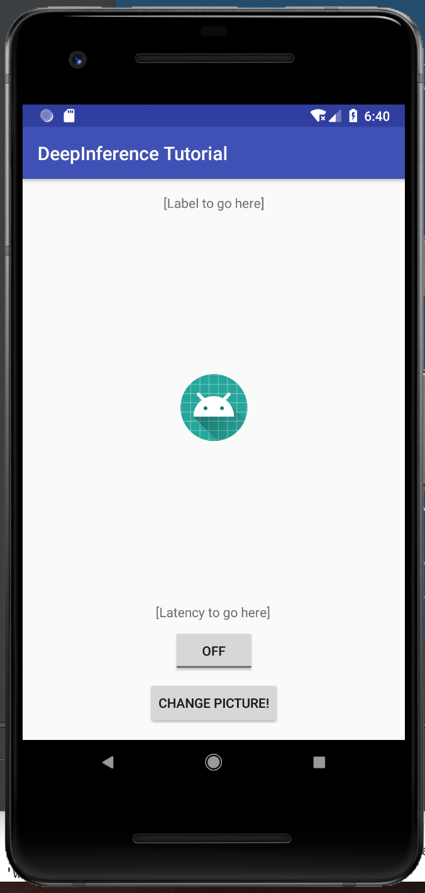


### Adding photos to your app

Again, just like in the first tutorial we want to get a set of photos, this time for testing on.

Just like last time right click and navigate New > Folder > Assets Folder to create a new assets folder.  Unlike last time, after your assets folder is created, right click on it and select "Reveal in Finder" (or whatever your OS equivalent is).  Create a new directory named "imgs" and add your images here.  This will be faster than adding through android studio since there is no confirmation screen.


#### What photos to add

The ImageNet classification dataset contains 1000 different categories.  You can take a quick look at it [here](https://gist.github.com/yrevar/942d3a0ac09ec9e5eb3a#file-imagenet1000_clsid_to_human-txt-L3) and see that it contains many different types of things, ranging from 'European fire salamander' to 'water bottle'.

This means that you can pick a wide range of photos and see how well the model does in recognizing them.  It can be interesting to pick a range of pictures that may confuse the network.  For instance, 


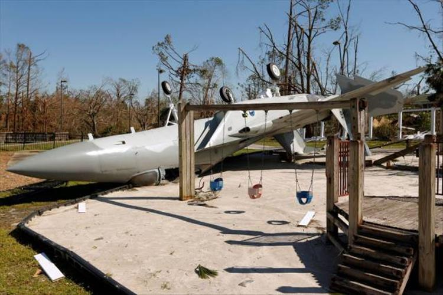


#### Setting up the code hooks

Since we are modeling this app largely on our first app we want to set the initial code hooks the same way.  That is, display a picture upon loading and then whenever the "Change Picture!" button is clicked, change to a random picture.
In the next section we'll eventually be using this click to be starting inference.


## Prepping for on-device inference 

### Getting models to use for inference

The first step using deep learning on your mobile is to get a model to use.  This can be either training your own from scratch, fine-tuning an existing model or downloading a pretrained model.  The first two methods are beyond the scope of this tutorial but for those interested [TensorFlow for Poets](https://codelabs.developers.google.com/codelabs/tensorflow-for-poets/#0) is a great resource.

Instead, we will be downloading a pre-trained TensorFlowLite InceptionV3 model from Google.  The direct link for the model is [here](https://storage.googleapis.com/download.tensorflow.org/models/tflite/model_zoo/upload_20180427/inception_v3_2018_04_27.tgz), which is from the Inception_V3 entry from the "Image Classification (Float Models)" at [this](https://www.tensorflow.org/lite/models).

Either way, the direct link ([here](https://storage.googleapis.com/download.tensorflow.org/models/tflite/model_zoo/upload_20180427/inception_v3_2018_04_27.tgz)) will download a \*.tgz file.  Unzip this file and move the contents to a folder called "model" in your assets folder.


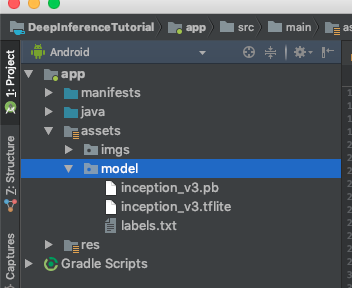


#### Quick background on Deep Learning model formats

If you look at the downloaded model package and the table linked above you might notice that there are a number of different file extensions (.tflite vs. .pb) as well as model kind ('float' vs 'quantized').  These represent different model formats and ways of compressing the resulting files.

The original model format for TensorFlow is the protobuf file (.pb extension) which contains the definitions of layers within the model and, in the case of 'frozen' models, their weights.  (In non-'frozen' models weights are stored in a separate file).  These protobufs could be used within TensorFlow and the frozen varient could be used on either a computer or mobile device.  Recently, TensorFlow introduced TensorFlowLite files (.tflite extension) which is optimized for mobile devices.  We will be using these in our application.

The difference between 'float' and 'quantized' versions of a model file are how well they can be compressed.  In 'float' versions weights are stored as floats which allows for maximal accuracy of results.  'Quantized' models have had these float values replaced with an integer approxiation which decreases accuracy slightly (although not as much as you may assume) which increasing compressibility of the model by introducing repetition in the file.  This allows for lower storage requirements and in some cases faster loading.


### Updating up our gradle

To use TensorFlowLite we need to let Android Studio know that we will be using it.  Therefore we need to add a line letting Android Studio know to compile and add in tensorflow-lite.
To do this add `compile 'org.tensorflow:tensorflow-lite:+'` to your app gradle file and resync.

Negative
: Note, gradle syncing can lead to some errors popping up about versions.  Try to fix them as best as you can -- Android Studio is generally fairly good at highlighting what issues exist, although their error messages may be somewhat crytic.

In addition due to how tflite files are loaded we need to ensure that they are not compressed when stored.  Therefore add the following to your gradle as well, under the `android{...}` header:
```
aaptOptions {
    noCompress "tflite"
    noCompress "lite"
}
```


## Coding for on-device inference

Okay!  So now we have more or less all the backend stuff set up.  We have models loaded onto device (and not compressed!), we have our grale updated to compile tensorflow-lite and we know a bit about how deep learning models are stored in TensorFlow.

Next we need to actually code them up!

Luckily, the actual inference boils down to just two lines.
Unluckily, there is a bit of extra code needed to get everything in the right format, but this isn't all that difficult.  These are part of the optimizations that are done for TensorFlowLite so it's worth it in the end.

### Running our tensorflow-lite model

Let's skip ahead of ourselves quickly and give a quick preview of how to use a TensorFlowLite model.  This will help because it is, at its core super simple.

If we have a TensorFlowLite model loaded into a variable called 'tflite' then we call it with just:
```
tflite.run(imgData, labelProbArray);
```
`imgData` is the input image data and `labelProbArray` is an array that is equal in size to the number of possible classes.  After the call `labelProbArray` contains the probability that an image is classified as a particular entry.

Super simple, right?  So let's get to how to set it up.


### Setting up our model

Setting up our model for inference is super easy.  We just need to create a new Interpreter object which we can pass inputs to.  We do this by passing it a MappedByteBuffer object, as below.

```
MappedByteBuffer tfliteModel = loadModelFile()
Interpreter tflite = new Interpreter(tfliteModel);
```

But wait.  How do we get this MappedByteBuffer file?
Well, that's one of the slightly tricky parts I mentioned before.  Essentially a MappedByteBuffer is a chunk of memory that is more quickly readable than other objects so it helps us use the model faster.  For the model we load this using the below function:

```
private MappedByteBuffer loadModelFile() throws IOException {
    AssetFileDescriptor fileDescriptor = getAssets().openFd(getModelPath());
    FileInputStream inputStream = new FileInputStream(fileDescriptor.getFileDescriptor());
    FileChannel fileChannel = inputStream.getChannel();
    long startOffset = fileDescriptor.getStartOffset();
    long declaredLength = fileDescriptor.getDeclaredLength();
    return fileChannel.map(FileChannel.MapMode.READ_ONLY, startOffset, declaredLength);
}
```

There's one more function that you need to define, `getModelPath()`, which is the path to your model in the assets folder.  While you can hardcode it, leaving it as a function allows you to have more flexibility in the future.


### Setting up our image data

With a similar eye towards speed, our image file needs to be loaded into a ByteBuffer file.  We do this in a two step process.
1. Load file into a bitmap object
    - This is important as deep networks generally only read bitmaps, and it means the object size is highly regular
2. Convert the bitmap to a Direct ByteBuffer.

#### Loading the bitmap

The loading of the bitmap can be done just like we do when setting the picture in the ImageView in the app.
There is one catch though: You need to resize the bitmap.  This can be done using the `createScaledBitmap(...)` function.

Positive
: Every deep learning network that works on images has its own settings for input datasize.  Most CNNs take in an image a square bitmap image.
*Inception has an input size of 299x299x3, where 3 is the number of colors.*  It is very important that when you resize the bitmap you resize it to this size or else you'll get some strange looking errors.


#### Converting the bitmap to a ByteBuffer

The first step is to create a Direct ByteBuffer.  We should have this be a global variable and only allocate this once or else we lose many of its advantages.  Therefore, in your `onCreate(...)` function you want to allocate it similar to below:
```
imgData = ByteBuffer.allocateDirect(
                        DIM_BATCH_SIZE
                                * SIZE_X
                                * SIZE_Y
                                * DIM_PIXEL_SIZE
                                * NUM_BYTES_PER_CHANNEL);
imgData.order(ByteOrder.nativeOrder());                           
```

Positive
: If you run into problems related to inference probability, e.g., low or constant probability, you should add the second function call above to enforce Endianness of the ByteBuffer. **We decide to be more explicit, instead of hinting, about ByteBuffer handling.**  

Let's quickly walk through what these variables are.
- *DIM_BATCH_SIZE* is the number of images we're submitting for inference at a time.  In this case we're only submitting 1.
- *SIZE_X* and *SIZE_Y* are the size of the input window and as discussed earlier should be 299
- *DIM_PIXEL_SIZE* is how many channels there are per pixel, which in our case is 3
- *NUM_BYTES_PER_CHANNEL* is how many bytes each pixel is stored as in our bitmap.  Since we'll be using a float based bitmap this is 4.


Okay, so now that our ByteBuffer is allocated let's read some data into it!
We do this pixel by pixel.  I'm giving you the code to do so below to ensure that the order is correct as it could be a hassle.
One extra function is also included, `addPixelValue(...)`.  This function is meant to do some pre-processining on the input image to ensure the average and standard deviation of brightness are similar to how the model was trained.  If nothing else, deep learning is fincky.  For InceptionV3 IMAGE_MEAN = 128 and IMAGE_STD = 128.0.


```
private void convertBitmapToByteBuffer(Bitmap bitmap) {
    int[] intValues = new int[SIZE_X * SIZE_Y];

    if (imgData == null) {
        return;
    }
    imgData.rewind();
    bitmap.getPixels(intValues, 0, bitmap.getWidth(), 0, 0, bitmap.getWidth(), bitmap.getHeight());
    // Convert the image to floating point.
    int pixel = 0;
    for (int i = 0; i < SIZE_X; ++i) {
        for (int j = 0; j < SIZE_Y; ++j) {
            final int val = intValues[pixel++];
            addPixelValue(val);
        }
    }
}
protected void addPixelValue(int pixelValue) {
    imgData.putFloat((((pixelValue >> 16) & 0xFF) - IMAGE_MEAN) / IMAGE_STD);
    imgData.putFloat((((pixelValue >> 8) & 0xFF) - IMAGE_MEAN) / IMAGE_STD);
    imgData.putFloat(((pixelValue & 0xFF) - IMAGE_MEAN) / IMAGE_STD);
}
```

Once you call the `convertBitmapToByteBuffer(...)` function on your resized bitmap you should be ready to do some inference!


### Setting up your response array

There are two arrays that we need to set up for dealing with our responses.  The first is our labels file.  This file is located in our assets folder and can be read in.  Each line should be a separate entry in an array of strings.
The second is an empty float array for that is passed to the inference function and written as the results of the inference.  What is written in each element is the percentage chance, in the range [0.0, 1.0), that class is what is in the image.  Therefore, this should be an array of shape [DIM_BATCH_SIZE][NUM_CLASSES].  In the example code I refer to this array as `labelProbArray`.


### Running inference!

Now we're all set to run inference!  We have our model, `tflite`, our input image data, `imgData`, and our array for results, `labelProbArray`!  Let's do this!

For inference we just call....
```
tflite.run(imgData, labelProbArray);
```

It's almost underwhelming, right?  That's the advantage of having everything else already set up, though.

### Processing results

After we call `run(...)` we now have a `labelProbArray` that contains probabilities of various classes.  What does that mean exactly?
Well, it means that if we look at a given entry it is the confidence of the network that that the label corresponding to that entry is the correct image.

For example, if we ignore the DIM_BATCH_SIZE dimension, since it will be 1 in our tutorial, if we have an array with the entries `[ 0.1 0.1 0.8]` and a list of labels of `['cat', 'dog', 'peacock']` it means that the model thinks that it is 80% sure that the image contains a peacock, while it admits there is a 10% change that it contains a cat or a dog.

What does that mean for us?  It means that we look at which entry of `labelProbArray` contains the highest value, and thus the highest confidence, and find the label that shares that index.  That's what our model things the image is of!

Using this we can update the UI using the same techniques we used in tutorial 1 to get something similar to below.

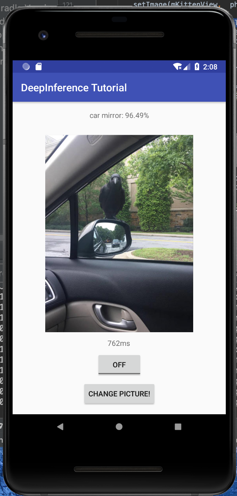

### One last thing!

You might notice that I've also update the time label that we set up way back when we set up our GUI. It looks pretty cool, right?
You should add one too!

Using the `SystemClock.uptimeMillis()` function you can track the start time and end time of inference (including image loading and processing!) and calculate this value yourself.  


## Off device inference

Phew, that was a lot!  Good job!
Now that we have on-device inference set up we are going to set up off-device inference.  I've set up a custom server at `http://35.243.243.163:54321/inception` that takes JPEGs as input and uses the same inception model we're using on-device for inference.  
This means that all we need to do is sent a POST request with our image.  Although this is easy there are a few complications we need to work through. It won't be hard, though!

But first there's some setup!

### Updating support files

There are two main support files that we need to update.

First we need to update the manifest to include permissions for our app to access the internet.  We do this by adding the line `<uses-permission android:name="android.permission.INTERNET"/>`.

The next file we need to update is the gradle file to include the library we're going to use for the POST requests.  In this case, we're going to be using okhttp, an HTTP library for android.  To include this library add the line `compile 'com.squareup.okhttp:okhttp:2.5.0'`, just like we did for tensorflow-lite.

This should set us up to get to programming our call!


### Sending a POST request

First, we need to define our server location.  As I've said, I set up a custom server. Let's make the location of it as a global so it's easy to find and change if need be.
```
    private String hosturl = "http://35.243.243.163:54321/inception";
```

Now that we have a server, we need to set up our call to this server.  There are three parts to this.
First, we need to create a RequestBody object that includes the file we want to send.
Second, We need to build a request with this request body.
Third, and finally, we need to send this request.

These calls can be a little bit annoying to string together so I'm putting them below.

```
RequestBody requestBody = new MultipartBuilder()
                .type(MultipartBuilder.FORM)
                .addFormDataPart("file", filename, RequestBody.create(MEDIA_TYPE_JPEG, file))
                .build();

Request request = new Request.Builder()
        .url(hosturl)
        .post(requestBody)
        .build();
        
Response response = client.newCall(request).execute();
```

*There is one catch.*  You can't actually send a file directly from the assets folder where it is currently stored.  Therefore to get the `filename` that you're sending, you need to read the file from assets and save it as a file to a readable location.  This is left for you to do!


### There is one catch....

You can't run HTTP requests on the main UI thread in Android.  You can try but you'll get a a nasty looking error as soon as you kick off inference.  You might've already tried and seen this error, if so then nice initiative!

This is something of a problem, but getting around it isn't particularly different.  We just need to do the inference as an AsyncTask.

This sounds daunting but we just need to set up a nested class that extends AsyncTask and has at very least a single `doInBackground(...)` function.  I've incldued the general outline below, with two extra functions that may prove useful.  

```
    private class RunInferenceAsync extends AsyncTask<String, Float, Long> {
        String results;
        String time;

        protected void onPreExecute() {
            // Stuff to do before inference starts
        }

        protected Long doInBackground(String... img_files) {

            String img_path = img_files[0];
            
            // Do inference here!
            
            return null;
        }

        protected void onPostExecute(Long result){
            // Stuff to do after inference ends
        }

    }
```

Once you have this class you simply call `new RunInferenceAsync().execute(photo)` and it will kick off this task in the background!

Now that you have this function you have all the tools to use remote inference as well!


## Pulling it all together!

Okay, now you have the tools for on-device and off-device inference!  You also have the basis for doing inference on a different thread than on the UI thread.  If you've been watching the console when running your app you might've noticed it complaining about skipping frames and doing too much work on the UI slide.

How about using the AsyncTask to make both inferences run in the background?


## Setting up your own server

Earlier I set up a custom server for you to use for your off-device inference.  I did this using Google Compute Engine (GCE) and a Flask server that would accept an image file and perform inference on it using the InceptionV3 model that we had been using on-device.
To enable you to host your own server, potentially with a different model, I'll give a quick overview of how to set up your own Flask server and then deploy it to either GCE or AWS.

Although I won't go into the details of how to perform inference with TensorFlow, it is a simple extension of the server and so should be easy to figure out.

### A simple Flask server

Flask provides a simple python server.  Although it's not able to do provide complicated functionality such as file serving or adding much security it gives us a quick and easy python-based solution for writing a server front-end.  It can also provide all the hooks needed to be used by nginx or apache servers, which are much more full-featured.

#### Setting up your application

The first step in setting up a Flask server is to set up the app that you'll be serving.  You do this with a simple line at the top of your file (after imports, before anything other functions) creating it:
```
app = flask.Flask(__name__)
```
This is also a good time to set up configuration details, such as `app.config['UPLOAD_FOLDER']` which may prove useful later on.

Next, you can start your server by adding the command `app.run(host="0.0.0.0", port=int("54321"), debug=True)` which will start a server on localhost on port 54321.  Therefore to access it you should go to [http://localhost:54321](http://localhost:54321). 

However, currently you have no endpoints for this app to use so it will simply give you an error.


#### Setting up endpoints

The idea behind setting up endpoints in Flask is that you identify which functions you want to be run when various paths are requested from the server.  These functions need to return the source of the page that we want to visit, which can be as simple as just a string.
You mark which function you want to run, and what methods can be used to access it, with the `@[app_name].route([path], methods=[methods list])` decorator.

For instance, to add a helloworld page located at `/hello` we can add the below code between where we define our `app` and where we run out server.

```
@app.route('/hello',methods=['GET', 'POST'])
def helloWorldFunc():
    return "Hello world!"
```
We can now restart our server and check out our new webpage at [http://localhost:54321/hello](http://localhost:54321/hello)


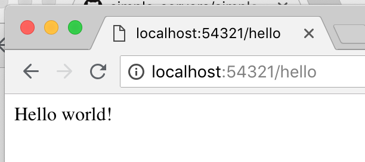

#### Working with requests

Now that we have our first endpoint set up, we need to figure out what we want to do with it.  This means looking at the specifics of the request.
We do this by working with the flask.request object that is automatically generated with each request.  We can, for instance, access its 'method' field to determine what kind of method the request used.  Below you can see the updated helloWorldFunc that takes this into account and changes its message.
```
@app.route('/hello',methods=['GET'])
def helloWorldFunc():
    if flask.request.method == 'POST':
        return "Hello Post!"
    elif flask.request.method == 'GET':
        return "Hello Get!"
    else:
        return "Hello world!"
```

You can also access the files within a request by using `flask.request.files[...]` where you give it the name the file is stored under.  In the case of our app this was 'file'.

#### Going further with Flask

This is just the basic introduction to Flask.  You can also call other functions like you would any other python code.  This makes it easy to quickly implement front ends for our functions.

Using this you can quickly set up a serving platform where an image is uploaded and inference is run on it.


## Deploying your server!

Now that you have a server you need to send some data to it.  While you can test it on your local computer this isn't an idea situation for a number of reasons.  Instead, let's get some experience setting up a server in the cloud that we can use.  First we'll run through setting up a server on 

### Google Computer Engine (GCE)

Google provides cloud-based servers that you can get to through the Google Compute Engine [Homepage](https://cloud.google.com/compute/).  From here click the "Go to Console" button.

#### Setting up a new instance

The page that opens should be the "VM Instances" page that contains a list of all of your running VMs, at this point likely it is empty.  To create a new VM click "Create Instance" at the top of the page to begin a process of setting up a VM.

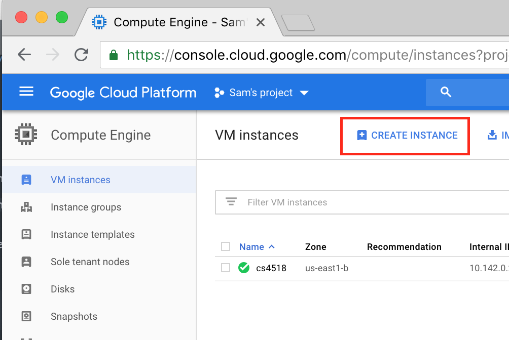

This will bring up a new page.  It will likely offer you the choice to take a tutorial or to set up a new VM from scratch (unfortunately I can't get a picture of this since I've already set one up).  Feel free to step through the tutorial first, so you have a sense of how it works, but to continue with this tutorial chose to set up a new VM from scratch.

This page will give you the option to customize your VM.  You can change a lot of things on this page but there are three things that you should make sure you do.

First, change the name of you VM to something recognizable, like cs4518-example.
Second, change the bootdisk of your VM to an image with TensorFlow pre-installed, such as the "Intel® optimized Deep Learning Image: TensorFlow 1.11.0" image.  This will help you if you are serving any deep learning model.
Finally, navigate to the Networking tab under "Management, security, disks, networking, sole tenancy" where under the "Network Tags" you should add "flask-server".  This is to enable us to open the appropriate ports for our server in a few steps.

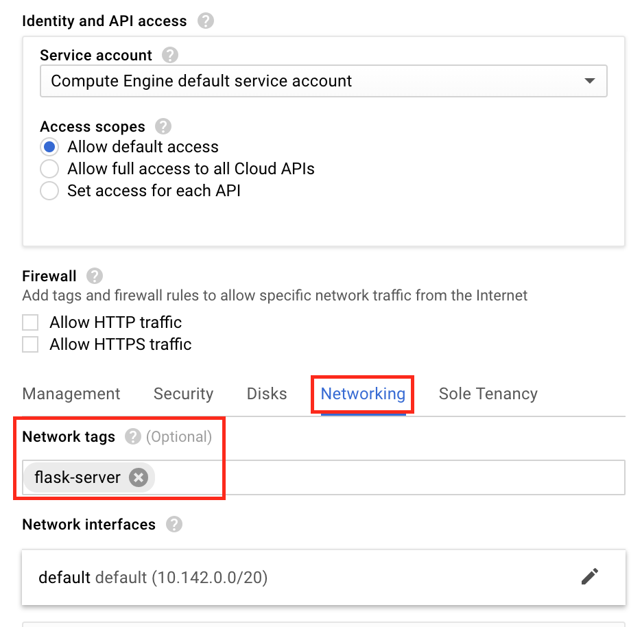

Once you have all the settings how you want them click "Create" at the bottom of the page and you'll have a new VM to use!


#### Setting up the network for serving!

Next step is to set up the ports that we'll be using for accessing our VM while serving.  To do this Use the sidebar menu to navigate to "VPC network" and then "Firewall rules".

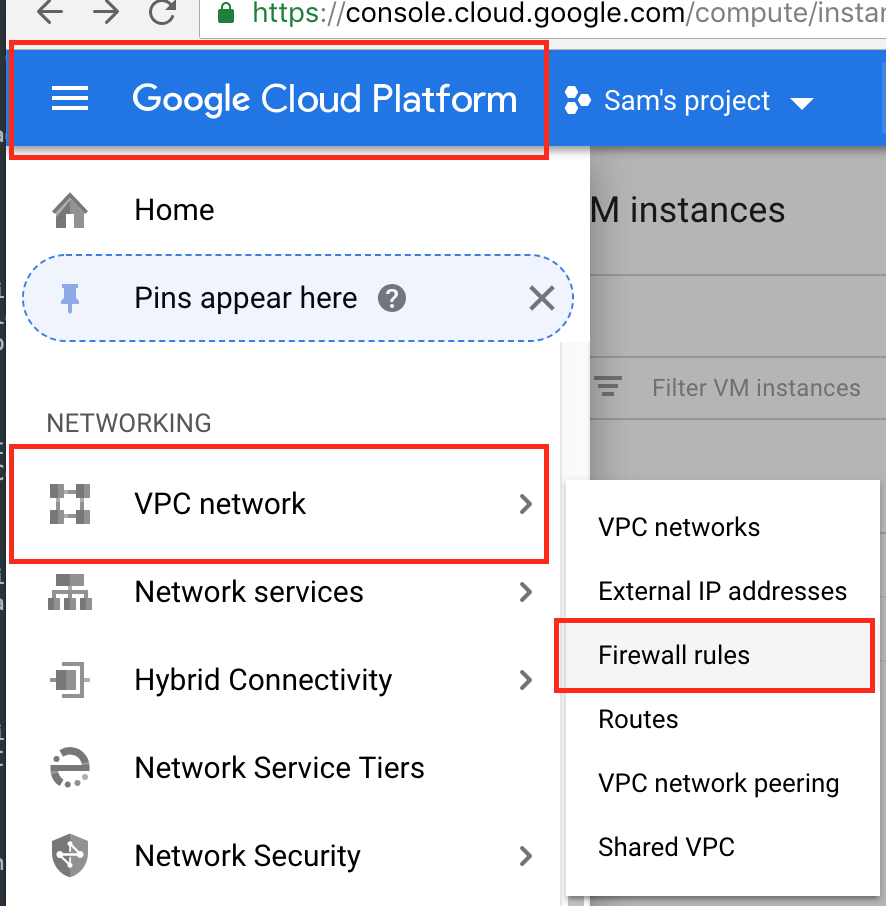

To create a new rule you need to click the big "CREATE FIREWALL RULE" at the top of the page which will bring up a dialogue to make a new rule.  The big things to change are:
1. Give it a name and optionally a description to you know what it does
2. Set "Source IP ranges" to 0.0.0.0/0.  This is on the permissive side as it allows access from all IPs, and you may want to consider shutting it down a bit if you know your subnet slice information.
3. Add "flask-server" to the "Target tags" field.  This allows any VM with this tag to interact with the outside world.
4. Under "Protocols and ports" add our port to the "tcp" field.  In our example so far this has been port 54321.

After you have these set up just click "Create" and your new rule will go live.


#### Connecting to your new VM and running your server

Head back to your VM instances page ("Google Cloud Platform" > "Compute Engine" > "VM instances"), and click the "SSH" button on the far right side of your instance name under "Connect".  This will pop up a browser based ssh terminal (nifty, eh?).

Once you have this terminal run the command `tmux`.  This command opens a virtual terminal that will stay open even if the ssh session closes.  This means that any commands you start will continue running even after you close the window.

After this, copy your flask server code to your VM instance.  There are a number of ways to do this, such as SCP or google file transfer techniques.  However, the easiest may to be to use your favorite text editor, such as Vim, and copy and paste your code over.

Finally, just run your script and your server should be running.

#### Querying your server

Back on your "VM instances" page you can find the IP of your website.  This is under the "External IP" column.  Enter this followed by your port and the path of your endpoint.  You should see your endpoint displayed!


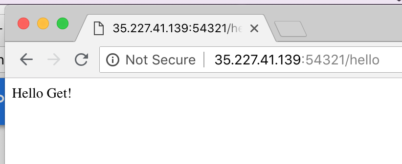


### Amazon Web Services (AWS)

As an alternative let's quickly look at how to deploy a server to AWS.  To start go to the [AWS Homepage](https://aws.amazon.com/) and click the "Sign In to the Console" button in the upper right corner.

#### Navigating the console

The AWS console homepage is a list of all the the available services AWS offers, which is a [confusingly] large number of services.  The one we are looked for is called simply "EC2".  You can find it either under the "Compute" heading or via the search bar.  When you clikc it it will take it to a page like the one below.  

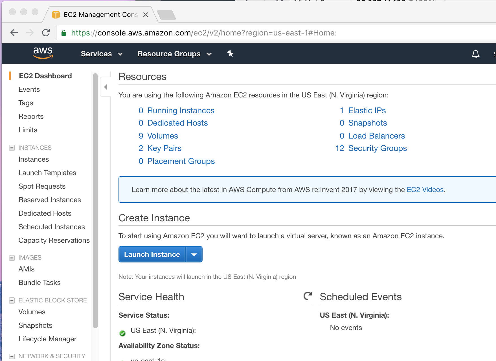

From this page click "Launch Instance" and you'll be brought to a new page to customize your instance.

#### Picking your Machine Image

The first step in setting up your server is to pick the kind of instance you want to use.  There is a wide range available, including both a basic Ubuntu server to specialized databases.
To make getting TensorFlow easier there is a Deep Learning specialized instance that has TensorFlow, and other frameworks, set up for the particular machines.  You can access this AMI under the "Community AMIs" tab where it's name is "Deep Learning AMI (Ubuntu) Version"


Select the AMI and this will take you to the next page

#### Picking your Instance Type

If you thought were a lot of options below there's even more now.  But don't worry, they're relatively simple!
Amazon organizes their images by machine types and then the relative sizes within those groupings.  For instance, `t2` instance are general purpose servers with a balance of aproximately 1CPU:2GB memory.  `t2.small` has 1CPU and 2GB memory while a `t2.2xlarge` has 8CPUs and 32GB of memory.

There are also other groups such as `p2` and `p3` machines which have GPUs (and are much more expensive!), `f1` machines which have FPGAs attached.

For now choose a `t2.micro` instance as it is possible to use these for free if you are in your first year of using AWS.  It should also be pre-selected.

Click the "Next: Configure Instance Details" button.

#### Configure Instance Details

This page allows you to set the details for your instance, such as the number of instances you are actually requesting and which network to use.  For this page just click "Next: Add Storage"

#### Add Storage

This page allows you to add or remove storage form your instance.  If you are using the deep learning AMI it will likely default to 75GB.  If not, I would recommend a minimum of 10-15GB.  

Click "Next: Add Tags"

#### Add Tags

On this page you can add tags to group your instances.  These tags could be something like "CLASS: CS4518" but aren't required.

Click "Next: Configure Security Group"

#### Configure Security Group

Finally we'll do something on this page!
On this page we will set rules for access through the firewall that Amazon provides for our instance.  We group these rules into "Security Groups" and can be used on various machines.  This is very similar to how we did it on GCE, just using a different interface.

You can see that one rule already exists in this group, allowing SSH access to any IP through port 22.  We're going to augment this to also allow access through port 54321.

First things first, change the "Security group name" to something more descriptive so you can find this group again.  I'm setting mine to "CS4518 server".
Next, click "Add Rule" and a new row should be created.  In this new row change the "Port Range" field to "54321", the "Source" to "0.0.0.0/0" (or select "anywhere" from the dropdown menu") and give it a simple description.  An example can be seen below.

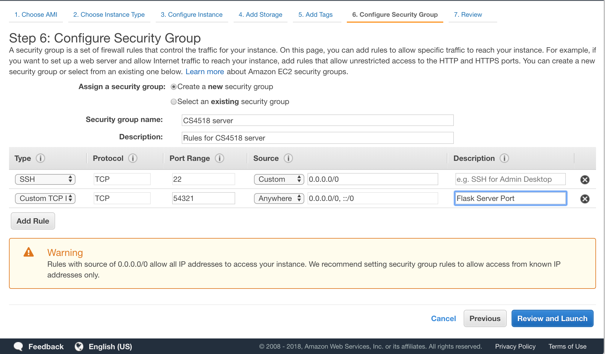

Positive
: As with GCE you can cut down access to your server if you can specify your subnet with higher accuracy.

Once you have your port added click "Review and Launch" and you'll be taken to a summary page.


#### Review Instance Launch

This page gives an overall summary of your server.  Click "Launch".

When you click launch AWS will ask you to create an SSH key to use to connect to your server.  You can use an existing key or create a new one which you will have to download to your computer.  
*Make sure that when you download this key you save it in a safe place is it not only allows access to your server but cannot be regenerated.*

Positive
: Typically on \*nix systems ssh keys, such as this \*.pem file, are stored in `~/.ssh` so you can store this key there for safe keeping.

After you have your key generated and stored in a safe place click "Launch Instances" and your instances will be started.

After this you will be taken to a "Launch Status" page where you can select "View Instances".  Click this and it will take you to your Instance page in the AWS console.

#### AWS Instances and connecting

On this page we can see all of our instances as well as details on them.  I obviously have quite a few that I use, as you can see below.  Therefore it can help to give your instance a name.  To do this hover over the Name column of your instance and click on the little pencil.  Fill in a name such as "CS4518 Server" so you can easily identify it.

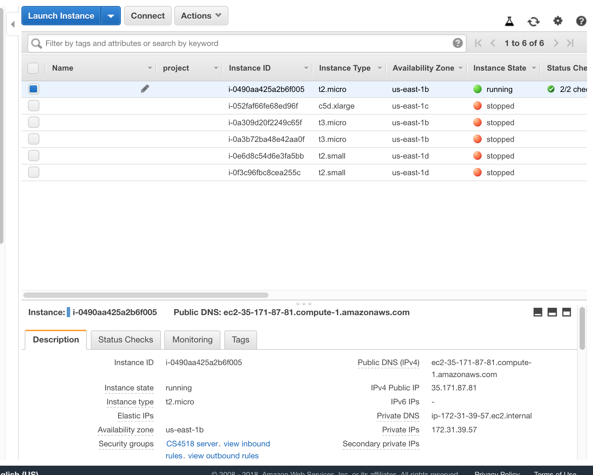

After you do this select your instance with the checkbox on the left side of its row and then click the connect button.  You can use either a standard SSH client, which has instructions provided in this window, or if you're not using chrome then you can use a browser based client.

Follow these instructions to connect to your server.  Two common issues you may run into are the permissions on your \*.pem file, which AWS explains how to fix, and that you need to put in the path to your \*.pem file as your terminal will not automatically discover it for you the first time.  You will also need to add the RSA fingerprint when it prompts you to do so.

Once you're connected to the instance you'll see something like the below, assuming you chose the Deep Learning image.


#### Using your AWS Instance

Using this instance is very similar to how we used our GCE instance, but with a few extra steps.

The first step is to run `tmux` to get a shell that won't be stopped when the ssh connection stops.
Next, run `source activate tensorflow_p27` to enter the virtual environment with TensorFlow for python2.7 established.  This will take a few minutes but if you are running TensorFlow in the background is very helpful, especially if you are using a GPU enabled server as it makes sure the TensorFlow installation is as optimized as possible.

Once this initialization is completed run "pip install flask" to install flask on your instance.

Finally, just like in GCE, copy your script to the server and run it.

#### Accessing our server

To find the DNS or IP associated with our instance we go back to the Instance view in the AWS console.  Once you've selected your instance this information should appear at the bottom of the page.  You can easily copy it by clicking the icon that appears when you hover over it, or highlighting it.


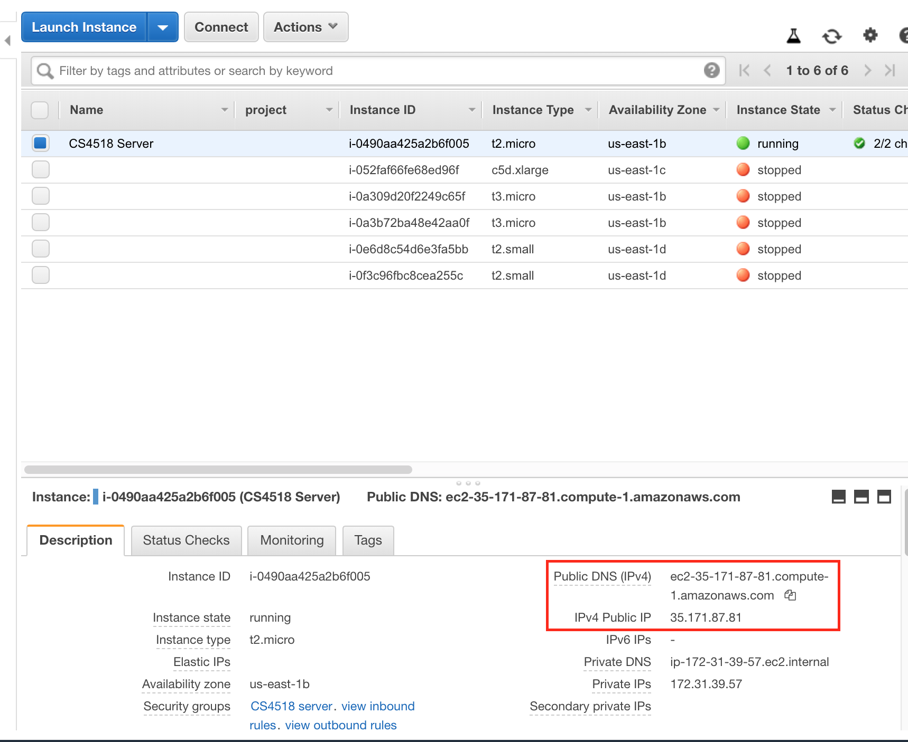


## Summary

Okay!  That was a whirlwind of topics!  We covered:
1. On-device inference with TensorFlowLite
2. Off-device inference with a pre-deployed server
3. Flask web platform for quick-and-dirty servers
4. Google Computer Engine servers
5. Amazon Web Services servers

Phew!
But we made it!  Congratulations!  Have fun developing your own deep learning projects!


