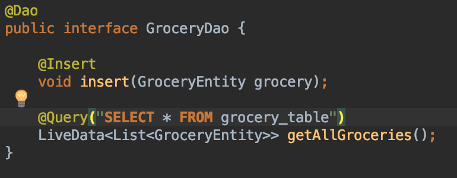
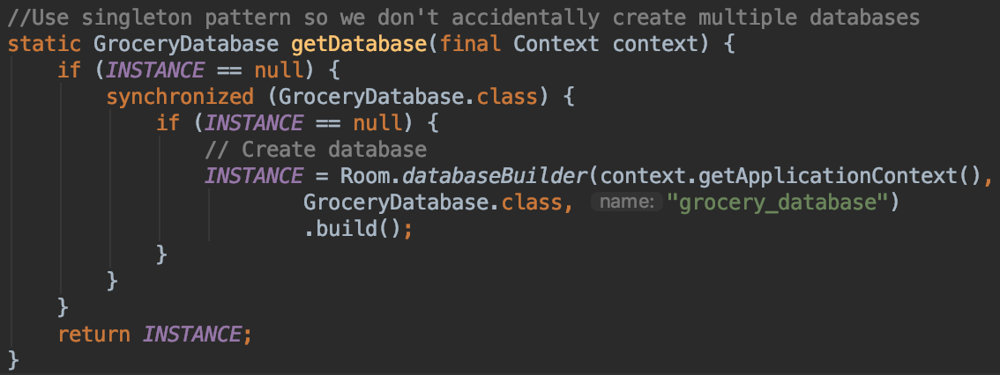

id:                ts1019

# Topic: Room Persistence Library - By Team 1019

## Project Overview

Room Persistence Library provides an abstract layer over SQLite, allowing for a
more fluid and robust database access. This topic is very relevant to mobile
computing due to the importance of communicating with databases. The use of a
SQL database makes it easier to store persistent information in a relational
format, but there is usually a large amount of overhead required in setting up a
database. This is especially an issue for smaller applications, where the
groundwork may not even be worth the benefits. The room persistence library does
much of the work for you, allowing developers to much quickly prototype and
develop SQL-based applications. Especially in a class like this, where we are
trying to cover a lot of material in a short time, it would be extremely
beneficial to spend less time developing SQL boilerplate and more time working
on the important or interesting parts of the application. In addition, in order
to train any sort of deep learning model, we will need a large set of training,
testing, validation data. Thus it is important that we have an easy way to
access our data such that we can continually update our model.

In this codelab you will be finishing a small Grocery List application utilizing
a Room Database. You will be looking at how to set up an entity class, create a
Data Access Object(DAO), and how to initialize and add to your database. Please
utilize the starter code provided with submission.

##  Grocery Entity Class Set-up

In Room library, you need to create an Entity. In Entity class you need to
define the set of related fields in your Table or more specifically define the
schema of your relational database. The Entity class allows more much
customization and declaration of your Database through annotations. Some are
listed for reference below.

**Annotations (Class):** *\@Entity( annotations, …, …)*

| Annotation                        | Description                                                   |
|-----------------------------------|---------------------------------------------------------------|
| primaryKeys = {“field1”,”field2”} | Define the Primary Keys in a Table                            |
| tableName = {“name”}              | Uses this name for the Table instead of the Entity Class Name |

**Annotations (Fields):**

| Annotation                        | Description                                                   |
|-----------------------------------|---------------------------------------------------------------|
| \@PrimaryKey | Sets the field to be the Primary Key of the DB                                        |
| \@ColumnInfo | Defines the name of the field in the DB                                               |
| \@NonNull    | Sets the field to not be Null in the DB                                               |
| \@Ignore     | Notifies Room that this field should not be persisted                                 |
| ..           | [More Info..](https://developer.android.com/training/data-storage/room/defining-data) |

You will need to navigate to the GroceryEntity class and add some information.
As you can see it currently only has fields for the id and name. You will need
to go ahead and add the entity information for quantity, notes, and filepath
fields as well as create the getters and setters. Please ensure you are
following the naming conventions used here as they are referenced in other
functions.

Creating a DAO
==============

A **DAO** is an interface that defines the methods or search queries able to be
done on your DataBase. It binds a Query to each of your queries in which you
define. The DAO class provides a seamless and easily way of inserting, deleting
and updating your table. Explanations of some of the annotations are provided
below.

| Annotation                        | Description                                                   |
|-----------------------------------|---------------------------------------------------------------|
| \@Insert | Room Generates an implementation that inserts all DAO’s into the table                       |
| \@Update | Uses a query to update all of the DAO’s respectfully in the table based on their Primary Key |
| \@Delete | Removes all entities from a table based on the DAO’s Primary Key                             |
| \@Query  | Allows you to read/write to the Database based on your customized query.                     |
| ...      | [More Info..](https://developer.android.com/training/data-storage/room/accessing-data)       |

If your interested in learning more about DAO’s check out the More Info link
that shows examples on how to inject your input into your queries, obtain direct
cursor access, query multiple tables, and more.

## Setting up the Database Class

In order to create and get the database we will be utilizing a singleton pattern
as highlighted here below. You will need to add this block of code to the
getDatabase function in the GroceryDatabase Class file. Note that we will be
using the singleton pattern here so we ensure that we never accidentally create
multiple instances of our database. Also note the annotation in the class
declaration. Room uses annotations to add metadata to a Java source file, they
can't affect the semantics of a program directly. This allows Room to be able to
check SQL queries at compile-time, which can save a lot of development time.

The outer If statement exists to check whether our Database has already been
initialized. As the GroceryDatabase is a Singleton, where one instance shall
only exists, it insures static access to the one instance of our
GroceryDatabase. The inner if statements provides a synchronized way of creating
our Database if it does not exist already. As multiple calls to this method
could potentially cause a synchronization problem.

## Taking Room Further

Now you should have a functioning app with the ability to add a grocery item to
the database without issue. However, right now once a grocery item is added
there is no way to get rid of it. With the time remaining in this topic survey
we encourage you to play around with the other associated methods with Room and
perhaps add delete or update functionality. Thanks for participating!

## References
Android Developer Documentation:
https://developer.android.com/training/data-storage/room/
