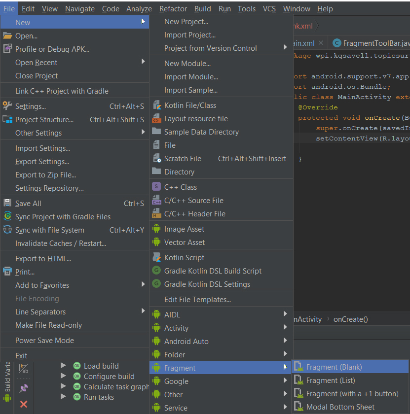
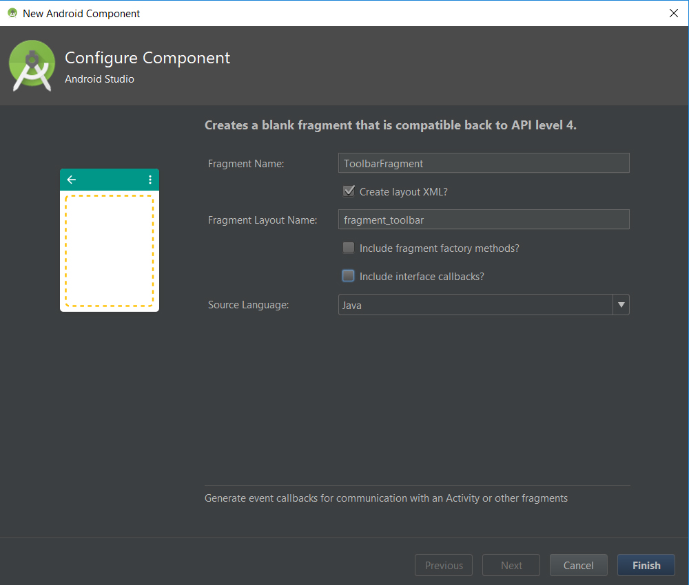
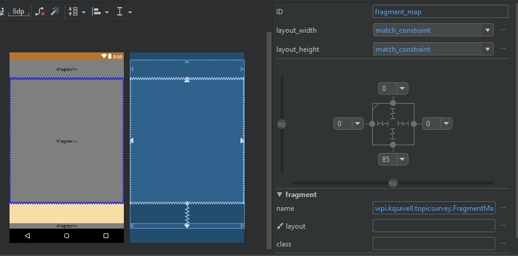
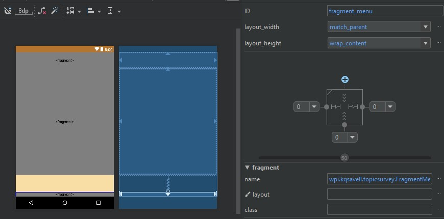
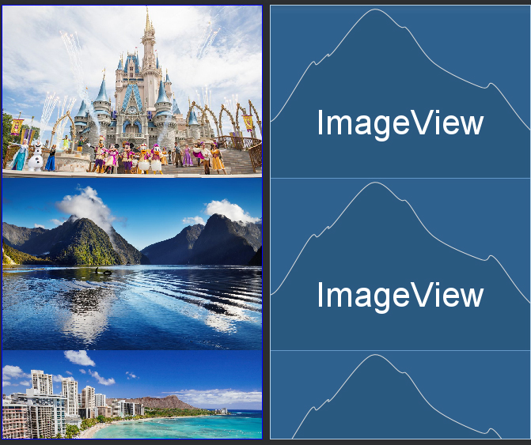
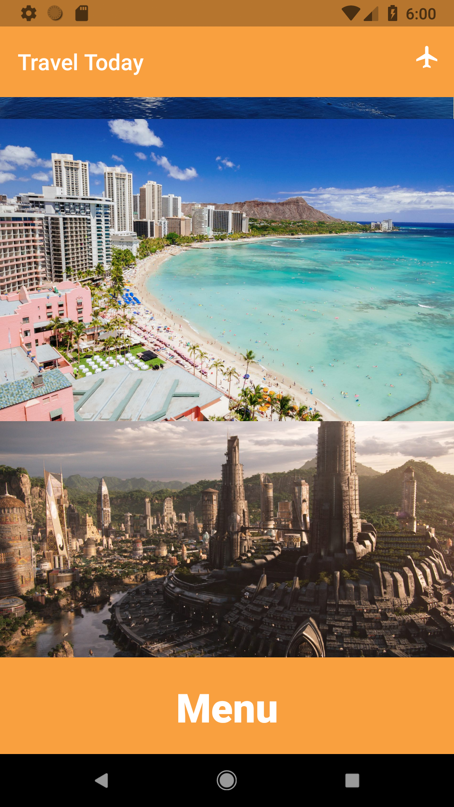
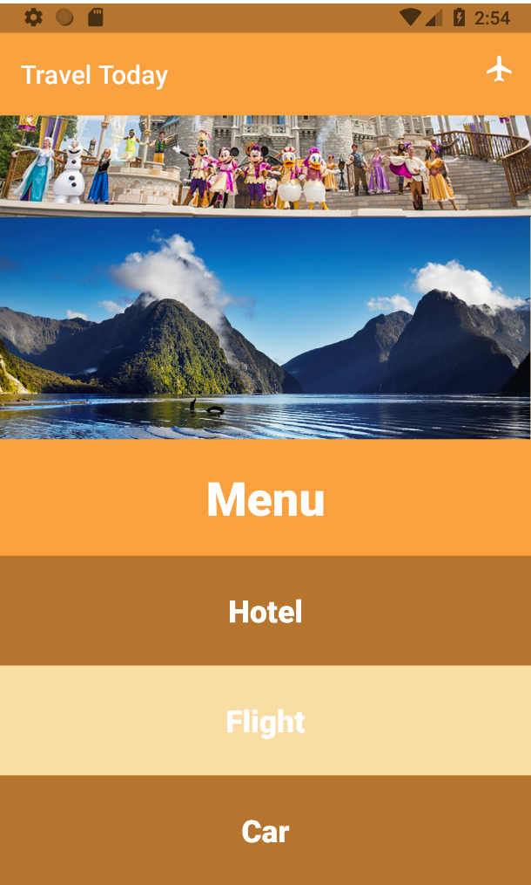

id: ts1031

# Topic Survey - by Team 1031 
## Google Material Design

### Created by:
- Antony Qin
- Kyle Savell
- Alex Tian
- Joseph Yuen

# Material Design Tutorial
## Tutorial Overview
This tutorial will show you how to spice up your applications using material design principles and styles. To do this, we will be editing the source code of a travel mobile application called *TravelToday*.

You will build a page of the TravelToday app that contains:

* A top app bar
* ScrollView backdrop
* A pull up menu
* Custom styling

In this tutorial you will do the following:

* Learn the principles of material design
* Separate a base application into a modular system
* Implement the above features
* Spice up the application with a custom style

Prerequisites:

* Android Studio Installed
* AVD installed with API 27 or later
* Starter Code Downloaded

#### Starter Code
Please the download the following starter code before you proceed to the next sections:
https://github.com/kqsavell/MaterialDesign_Codelab/archive/starting_code.zip

The starter code contains a bland looking application that has a basic toolbar, a picture of Honolulu, and some blank white space underneath.


## What is Material Design?
Material Design is a visual language that synthesizes the classic principles of good design with the innovation of technology and science. 

### Goals
* Create - Create a visual language that synthesizes the classic principles of good design with the innovation and possibility of technology and science.
* Unify - Develop a single underlying system that unifies the user experience across platforms, devices, and input methods.
* Customize - Expand Material’s visual language and provide a flexible foundation for innovation and brand expression.

### Principles
* Material is the Metaphor
* Bold, Graphic, Intentional
* Motion Provides Meaning
* Flexible Foundation
* Cross-Platform

### Styles
This tutorial will focus on the use of styles to customize widget:
* Color
* Layout
* Interactivity


## Modularize *TravelToday*

First thing we want to do is modularize the separate aspects of the application into fragments. This streamlines the code so that all functionality is not jam packed into a single file, and makes updating separate features easier in the future.

* First navigate to  and select `File > New > Fragment > Fragment (Blank)` 



* Name the new fragment `ToolbarFragment`. Make sure that the option ‘Create layout XML?’ is checked. Uncheck the two includes (‘include fragment factory methods? & include interface callback?’).



* Do the same to create our fragment for holding images (call it `MapFragment`), and fragment for holding a pop up menu (call it `MenuFragment`).
* Now let’s add our fragments so that our `MainActivity` retains the same functionality as before. 
* Delete all the children of the `activity_main.xml`, except the root layout. 
* Navigate to the palette, and drag in a `<fragment>`.
* Select the `ToolbarFragment` and constrain its top to the top of the screen, with 0 to the left and right so it stays centered.


* Drag in another `<fragment>`, and select `MapFragment`. Constrain the top of this fragment to the bottom of the `ToolbarFragment`. Constrain its bottom to 85dp off the bottom of the screen. That 85dp will be filled in by the `MenuFragment` when it’s inflated.



* Finally drag in the last `<fragment>`, as `MenuFragment`, and constrain its bottom to the bottom of the screen, with 0 to the left and right. 



## Implement Widgets

### Making a custom action bar

The first widget we will add to the application is a custom ActionBar. The ActionBar is the bar at the top of the screen by default.


It is important to make the ActionBar as easy to use and readable as possible. In Material Design it is common to use symbolic icons for menu items in the ActionBar, since they reduce clutter and are readable across languages. Thus, we will be adding a mockup menu icon to our ActionBar.

In order customize the ActionBar, the default one needs to be removed and a new one must be created. To get rid of the old ActionBar, an application theme without an ActionBar can be used. The application theme can be edited in the styles.xml file, which is found in the values directory of the resources. In the style tag, the theme can be changed to another default one:

`<style name="AppTheme" parent="Theme.AppCompat.Light.NoActionBar">`

The "NoActionBar" themes do not have an ActionBar to start with, so any of these themes can be used.

Next, we need to add the new ActionBar to the layout. To do this, we will be filling the toolbar fragment we made with a xml layout. In the resources folder created a new directory called “menu”. In the menu directory create a new xml resource file (we named ours "actions"). Replace the default code of this new xml file with the given:

``` xml
<?xml version="1.0" encoding="utf-8"?>
<menu xmlns:android="http://schemas.android.com/apk/res/android"
    xmlns:app="http://schemas.android.com/apk/res-auto">

    <item
        android:id="@+id/action_airplane"
        android:icon="@drawable/outline_flight_24"
        android:title="@string/app_icon"
        app:showAsAction="always" />

</menu>
```

The icon is an airplane icon that we have provided. Note that for ActionBar items the title attribute must always exist. If you wanted to add additional icons to the ActionBar, more item tags can be added to this xml resource.

Navigate to fragment_toolbar.xml and add the following code in order to add a toolbar to our toolbar fragment:

``` xml
<?xml version="1.0" encoding="utf-8"?>
<android.support.constraint.ConstraintLayout xmlns:android="http://schemas.android.com/apk/res/android"
    xmlns:app="http://schemas.android.com/apk/res-auto"
    android:layout_width="match_parent"
    android:layout_height="match_parent">

    <android.support.v7.widget.Toolbar
        android:id="@+id/toolbar_fragmentToolBar"
        android:layout_width="match_parent"
        android:layout_height="match_parent"
        android:background="?attr/colorPrimary"
        android:elevation="4dp"
        android:theme="@style/ThemeOverlay.AppCompat.ActionBar"
        app:popupTheme="@style/ThemeOverlay.AppCompat.Light" />

</android.support.constraint.ConstraintLayout>
```

Navigate to `ToolbarFragment.java` and refactor the base code so that it looks like this:

``` java
private Toolbar mToolbar;

    @Override
    public View onCreateView(@NonNull LayoutInflater inflater, ViewGroup container, Bundle savedInstanceState)
    {
        View view = inflater.inflate(R.layout.fragment_toolbar, container, false);

        mToolbar = view.findViewById(R.id.toolbar_fragmentToolBar);
        ((AppCompatActivity) getActivity()).setSupportActionBar(mToolbar);

        setHasOptionsMenu(true);

        return view;
    }
```

To add this icon to the Toolbar we created, we will need to inflate it when the Toolbar is created. We can do this by adding an overidden `onCreateOptionsMenu` callback underneath `onCreateView`:

``` java
@Override
    public void onCreateOptionsMenu(Menu menu, MenuInflater inflater)
    {
        inflater.inflate(R.menu.actions, menu);
        super.onCreateOptionsMenu(menu,inflater);
    }
```

Now when you run the application, the ActionBar should look as so (the colors may be different):


### ScrollView

Now that we have the app bar, let’s add some content to the middle of the screen. We will be adding a ScrollView to the map fragment that we made, which allows the user to scroll through a layout by dragging on the screen. This adds a degree of interactivity that is important in Material Design. We used to following code in the `fragment_map.xml` file for the ScrollView:

``` xml
<?xml version="1.0" encoding="utf-8"?>
<android.support.constraint.ConstraintLayout
    xmlns:android="http://schemas.android.com/apk/res/android"
    xmlns:app="http://schemas.android.com/apk/res-auto"
    android:layout_width="match_parent"
    android:layout_height="match_parent">

    <ScrollView
        android:layout_width="match_parent"
        android:layout_height="match_parent"
        android:layout_margin="0dp"
        android:padding="0dp">

        <LinearLayout
            android:layout_width="match_parent"
            android:layout_height="wrap_content"
            android:layout_margin="0dp"
            android:gravity="top|center|fill"
            android:orientation="vertical"
            android:padding="0dp">

            <ImageView
                android:id="@+id/imageView_disney"
                android:layout_width="match_parent"
                android:layout_height="wrap_content"
                android:adjustViewBounds="true"
                app:srcCompat="@mipmap/disney" />

            <ImageView
                android:id="@+id/imageView_newzealand"
                android:layout_width="wrap_content"
                android:layout_height="wrap_content"
                android:adjustViewBounds="true"
                android:scaleType="fitStart"
                app:srcCompat="@mipmap/newzealand" />

            <ImageView
                android:id="@+id/imageView_honolulu"
                android:layout_width="wrap_content"
                android:layout_height="wrap_content"
                android:adjustViewBounds="true"
                android:scaleType="fitXY"
                android:visibility="visible"
                app:srcCompat="@mipmap/honolulu" />

            <ImageView
                android:id="@+id/imageView_wakanda"
                android:layout_width="match_parent"
                android:layout_height="wrap_content"
                android:adjustViewBounds="true"
                android:scaleType="fitXY"
                app:srcCompat="@mipmap/wakanda" />
        </LinearLayout>
    </ScrollView>

</android.support.constraint.ConstraintLayout>
```

There are a couple things to note here. First, we have a LinearLayout inside of the ScrollView. This way the screen can be scrolled up and down. Second, each image item in the LinearLayout has the `android:adjustViewBounds` attribute set to true. This formats the images so that there is no blank space between each image.

Feel free to add any images of your choosing to each item or you can use the images provided. Your map fragment should look something like this in the design view:



### Pull-up Menu

Material design dictates that motion should provide meaning. *TravelToday* requires a menu, so let’s implement a menu at the bottom of the screen which provides feedback to the user. 

First we have to create another .xml file to implement the menu. Right click on /res/layout and make a new file called `bottom_sheet.xml`. We have to make this file to contain the `fragment_menu.xml` in a coordinator layout.  

To do this, in your newly created file, replace the code with:

``` xml
<?xml version="1.0" encoding="utf-8"?>
<android.support.design.widget.CoordinatorLayout xmlns:android="http://schemas.android.com/apk/res/android"
   xmlns:app="http://schemas.android.com/apk/res-auto"
   xmlns:tools="http://schemas.android.com/tools"
   android:layout_width="match_parent"
   android:layout_height="match_parent"
   tools:context=".MainActivity">

   <!-- include fragment_menu.xml -->
   <include layout="@layout/fragment_menu" />

</android.support.design.widget.CoordinatorLayout>
```

Now we have to make the actual menu in `fragment_menu.xml`. In the menu, we’ll include 4 total buttons. Copy in the code below into `fragment_menu.xml` to make these buttons. 

``` xml
<?xml version="1.0" encoding="utf-8"?>
<LinearLayout xmlns:android="http://schemas.android.com/apk/res/android"
   xmlns:app="http://schemas.android.com/apk/res-auto"
   android:id="@+id/bottom_sheet"
   android:layout_width="match_parent"
   android:layout_height="345dp"
   android:background="@android:color/darker_gray"
   android:orientation="vertical"
   app:behavior_hideable="true"
   app:behavior_peekHeight="90dp"
   app:layout_behavior="android.support.design.widget.BottomSheetBehavior">

   <Button
       android:id="@+id/button"
       android:layout_width="match_parent"
       android:layout_height="90dp"
       android:gravity="center"
       android:text="Menu" />

   <Button
       android:id="@+id/hotel"
       android:layout_width="match_parent"
       android:layout_height="85dp"
       android:gravity="center"
       android:text="Hotel" />

   <Button
       android:id="@+id/flight"
       android:layout_width="match_parent"
       android:layout_height="85dp"
       android:gravity="center"
       android:text="Flight" />

   <Button
       android:id="@+id/car"
       android:layout_width="match_parent"
       android:layout_height="85dp"
       android:gravity="center"
       android:text="Car" />

</LinearLayout>
```

You might notice that our strings are hard-coded in. If you would like to replace these with resources from the strings folder, feel free to do so.

At this point, you have made the base design components of the menu, but we need to inflate it and make it functional.

We’re going to head over to `MenuFragment.java` and add in the following code to give life to our menu. By default, the menu can only be expanded and collapsed by dragging. To create a better user experience, we can override the top button’s `onClick` functionality. We have also included other helpful overrides if you choose to use a bottom sheet in your next project:

``` Java
public class MenuFragment extends Fragment
{
   @Override
   public View onCreateView(@NonNull LayoutInflater inflater, ViewGroup container, Bundle savedInstanceState)
   {
       View view = inflater.inflate(R.layout.bottom_sheet, container, false);

       // get bottom sheet view
       LinearLayout mBottomSheet = (LinearLayout) view.findViewById(R.id.bottom_sheet);

       Button mButton = (Button) view.findViewById(R.id.button);

       // init bottom sheet behavior from mBottomSheet object
       final BottomSheetBehavior bottomSheetBehavior = BottomSheetBehavior.from(mBottomSheet);

       // change state of bottom sheet
       bottomSheetBehavior.setState(BottomSheetBehavior.STATE_COLLAPSED);

       // feel free to play around with these other states
       //bottomSheetBehavior.setState(BottomSheetBehavior.STATE_EXPANDED);
       //bottomSheetBehavior.setState(BottomSheetBehavior.STATE_HIDDEN);

       mButton.setOnClickListener(new View.OnClickListener() {
           @Override
           public void onClick(View v) {
               if (bottomSheetBehavior.getState() == BottomSheetBehavior.STATE_EXPANDED) {
                   bottomSheetBehavior.setState(BottomSheetBehavior.STATE_COLLAPSED);
               } else {
                   bottomSheetBehavior.setState(BottomSheetBehavior.STATE_EXPANDED);
               }

           }
       });

       // here are some overrides for reference if you choose to use BottomSheetBehavior in your next project
       bottomSheetBehavior.setBottomSheetCallback(new BottomSheetBehavior.BottomSheetCallback() {
           @Override
           public void onStateChanged(@NonNull View bottomSheet, int newState) {
           }

           @Override
           public void onSlide(@NonNull View bottomSheet, float slideOffset) {

           }
       });

       return view;

   }
}
```





## Stylize *TravelToday*

### Colors and Styles

Next, let’s choose a color scheme to properly represent the app, as well as draw user’s attention to important signifiers of action. In this system, a primary and a secondary color are typically selected to represent your brand. Dark and light variants of each color can then be applied to your UI in different ways.

A primary color is the color displayed most frequently across your app’s screens and components. A secondary color provides more ways to accent and distinguish your product. Having a secondary color is optional, and should be applied sparingly to accent select parts of your UI.

To create contrast between UI elements, such as distinguishing a top app bar from a system bar, you can use light or dark variants of your primary color on each elements.

* Go to https://coolors.co/545e75-63adf2-a7cced-304d6d-82a0bc, which generates a random set of colors that work well with each other. Press the spacebar to generate a new set of colors. Press the lock button an the colors you want to use before pressing space to keep those colors in the new sets you create.
* Pick 2 colors that you think would work as a primary and secondary color and save their hex codes. They should be different from each other. Pick a darker shade of the primary color by hovering over the color in coolors.co and pressing the square grid icon.
* Navigate to colors.xml under the res directory.
* Set the hex value of `colorPrimary` to your primary color, the hex value of `colorPrimaryDark` to the darker shade of your primary color,
And the hex value of `colorAccent` to your secondary color.
** If you ever think that you need more colors to make your app look beautiful, you can simply add the in the same way you added the other colors. For example, you could add a color called `colorPrimaryLight`, which is a lighter shade of your primary color.
* Add another color called `textColorPrimary` and make it a color that stands out from your primary color. Usually this is either white (`#FFFFFF`) or black (`#000000`). You can do this by adding this line in colors.xml:

``` xml
<color name="textColorPrimary">#FFFFFF</color>
```

*In styles.xml, which is in the same location as colors.xml add the color in the AppTheme style.


``` xml
<style name="AppTheme" parent="Theme.AppCompat.Light.NoActionBar">
        <!-- Customize your theme here. -->
        <item name="colorPrimary">@color/colorPrimary</item>
        <item name="colorPrimaryDark">@color/colorPrimaryDark</item>
        <item name="colorAccent">@color/colorAccent</item>
        <item name="android:textColorPrimary">@color/textColorPrimary</item>
    </style>
```

* If you want the icons at the top of the screen to be black instead of white, then add the following line in the AppTheme style

``` xml
<item name="android:windowLightStatusBar" tools:targetApi="m">true</item>
```

* Next we will change the color of the toolbar to your primary color. Add the following style to your styles.xml to do this.

``` xml
<style name="Widget.Material.Toolbar" parent="Widget.AppCompat.Toolbar">
        <item name="android:background">?attr/colorPrimary</item>
        <item name="android:theme">@style/AppTheme</item>
        <item name="popupTheme">@style/ThemeOverlay.AppCompat.Light</item>
    </style>
```

* If you want to change the color of the background of the whole app, add `android:background=”@color/. . .”` under `<android.support.constraint.ConstraintLayout` in `activity_main.xml`. Try out different colors and see what works. Your `activity_main.xml` file should look like this:

``` xml
<?xml version="1.0" encoding="utf-8"?>
<android.support.constraint.ConstraintLayout xmlns:android="http://schemas.android.com/apk/res/android"
    xmlns:app="http://schemas.android.com/apk/res-auto"
    xmlns:tools="http://schemas.android.com/tools"
    android:id="@+id/constraintLayout"
    android:layout_width="match_parent"
    android:layout_height="match_parent"
    android:background="@color/colorAccent"
    tools:context=".MainActivity">
    ...
```

* Now we will add styles for the menu buttons. Styles allow you to specify certain attributes you want to apply to specific components. Here, we will change the color and text of the buttons in the menu. We will create a style called `ButtonMenu` for the button that opens the menu, and styles `ButtonMenuItem1` and `ButtonMenuItem2` for the buttons in the menu.
* First we will create the `ButtonMenu` style. We will set the color of the button to the primary color, change the text size to `36dp`, make the text bold, change the text color to the primary text color, and set `textAllCaps` to false. Add the following code to `styles.xml`  to create this style:

``` xml
<style name = "ButtonMenu" parent = "Widget.AppCompat.Button" >
        <item name="android:background">@color/colorPrimary</item>
        <item name="android:theme">@style/AppTheme</item>
        <item name="popupTheme">@style/ThemeOverlay.AppCompat.Light</item>
        <item name="android:textSize">36dp</item>
        <item name="android:textStyle">bold</item>
        <item name="android:textAllCaps">false</item>
</style>
```

* The code for adding styles for the menu items is very similar. The only two things you have to change are `android:background` and `android:textSize` items. Make two more styles, called `ButtonMenuItem1` and `ButtonMenuItem2` in the same way you made the `ButtonMenu` style, just with those two items changed to the color and size you would like. The color of `ButtonMenuItem1` should be different than the color of `ButtonMenuItem2`.
* Just creating the styles will not change the UI of your app. You need to apply these styles to each element in the layout. Fortunately, this only requires one line to do. 
* Navigate to `res/layout/fragment_menu.xml`. The first `Button` element in this file is the button that opens the menu. Add `style=”@style/ButtonMenu”` under the `Button` element, just like this:

``` xml
<Button
	style=”@style/ButtonMenu”
	android:id=”@+id/button”
	…
	/>
```

* For the next 3 `Buttons`, add the `ButtonMenuItem1` style, `ButtonMenuItem2` style, and `ButtonMenuItem1` style in that order.
* Run your app and marvel at how beautiful your app has become!


## Congratulations, you’ve completed the tutorial on emulating the practices of Google Material Design!
