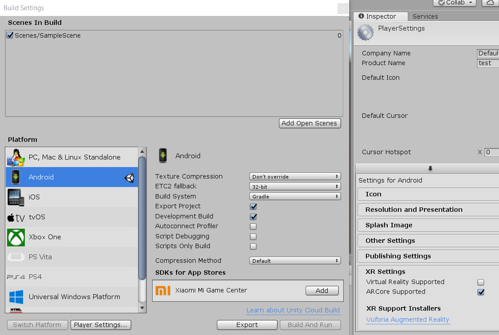
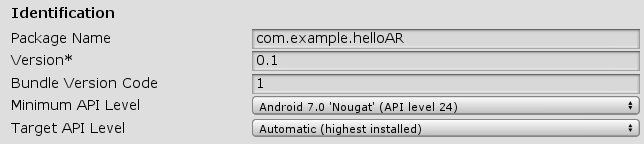
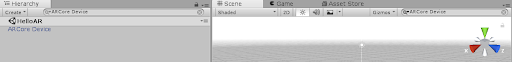
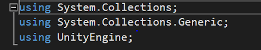
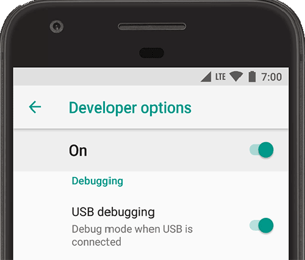
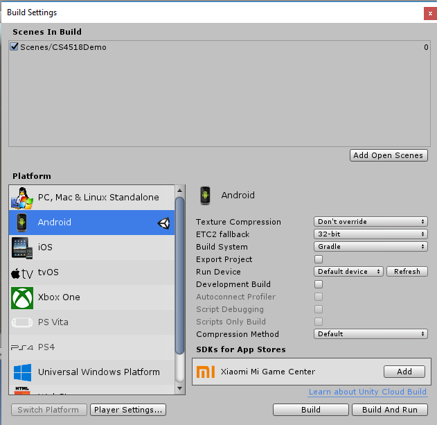

id:     ts1039  
author: Alex Hard, Erika Snow, Alexandra Wheeler, Joan Wong  
summary: CS4518 Tutorial: ARCore  
categories: common  
environment: markdown  
status: draft  


# CS4518 Tutorial: ARCore - By Team 1039

## Install Software
In order to complete this tutorial, the following software must be downloaded:

- Unity: https://unity3d.com/get-unity/download (select personal)
    - Note: please ensure that Android Build Support is selected during installation
- ARCore SDK for Unity: https://github.com/google-ar/arcore-unity-sdk/releases 
- Starter code: https://github.com/Redslaya/ARCore 

## Setting up the Environment
In your Unity project, it is necessary to configure the environment to support Android and augmented reality (AR). In Unity, select `File -> Build Settings`, and a new window should appear with the option to select the platform. Select `Android` in the platform list and click the **Switch Platform** button below. This may take a few seconds to change. Afterwards, click the **Player Settings** button.



The player settings should appear on the rightmost column on the screen. In `Players Settings`, you must select the `Other Settings` tab. Within this tab, you are required to change the `Package Name` just as you would in Android Studio. Below the package name you need to change the minimum API level and target API level.

ARCore is available on Android 7.0 (Nougat) and higher devices. Set the Minimum API level to Android 7.0 (API level 24). For Target API Level, set it to Automatic (highest installed). 



We’re not quite done yet. In the Player Settings, scroll down until you see the tab `XR Settings`. In the XR Settings, check the **ARCore Supported** box.

## Create the Scene

### Add ARCore Device
In order to create the scene properly, we first need to import the ARCore SDK package. We have incorporated the SDK into the starter code package you downloaded from the Github. To do so, navigate to `Assets/Import Package/Custom Package` and find the CS4518 package in the File Explorer. When you import the package, make sure all the items are pre-checked. This will put all the contents of the package to the Assets folder of your project.

Next, use the search bar above your project directory hierarchy to find the ARCore Device. Drag this into your scene, and then delete the main camera.

Once you have added the ARCore Device to the scene, you need to set the proper configuration for the device. to do so, go to `Assets -> prefabs` and drag `AugmentedImagesSessionConfig` into the Device Session variable in ARCore Device. 



### Add Scene Controller
The next step is to add a scene controller that will be used to coordinate between ARCore and Unity. 

First, in your project directory hierarchy, navigate to `Assets -> Prefabs` and find the prefab called canvas. Drag it into your scene. Next, create an empty game object in your scene heirarchy by selecting `Create -> Create Empty` and change its name to SceneController. 

Search for the script called AugmentedImageController.cs in your project directory hierarchy, and drag it onto SceneController. Then, in `Assets -> prefabs`, drag the `AugmentedImageVisualizer` prefab into the `Augmented Image Visualizer Prefab` variable under the script section of your SceneController. Also in this script, drag in the `FitToScanOverlay`, a child of canvas, from your scene to `Fit To Scan Overlay`.


### Add Event System
Next, go to `Create -> UI -> Event System`. This will automatically add the event to the scene. 

## Add Image Database
Next, we need to add an Image Target to our image target database. This database allows multiple image targets to display the same visualization. Thankfully, the ARCore SDK includes a basic database for us to use. To find this database, search in the project hierarchy for "Example database” and click on the Unity object that appears. 

If your database does not already include a picture, we have provided an image file of the WPI logo in `Assets -> prefabs` for you to use. Simply click select on the empty image and look for the WPI logo in the box that appears! Images with unique patterns and contrasting colors work best. The database will automatically give you a score for how good of a target your image is. You should aim to use images with a score of 85 or above. 

## Make the Cube Rotate
This next step is just to add a little pizzazz to our project.

In the project hierarchy, under `Assets` create a folder named `Scripts` and create a new C# file. If you have Visual Studio installed, this should pull up the IDE, where you can start writing the script. Otherwise, pull up your favorite text editor and navigate to the file in your Unity project. Outside of the class, make sure you have the following lines:



Inside the class, you should see a Start function and an Update function. We do not need to do any initialization for this script, so we can ignore the Start function. If you want, you can even delete it. The Update function will run once per frame, so this is where we need to write our code to make the cube spin. Add the following line: 

```
transform.Rotate(Vector3.up, speed * Time.deltaTime);
```

Finally, we need to declare and set the variable speed within the class. This variable should be public so it can be easily updated from inside the editor. It should be a float, and you can set the value to whatever you want, we reccommend starting with 100. Experiment with different values and see what you like.

So now we have a script for rotating any object, but now we need to attach it to the cube. Save the file and navigate back to the Unity screen. Unity makes this part really simple. All you need to do is navigate to the script in your assets/scripts folder, and drag it onto the cube within the scene. In you scene hierarchy click on the Scene Controller, then double click on AugmentedImageVisualizer. Finally double click on the cube. Then drag the script from `assets/scripts` onto the cube and type 100 into the speed variable. 

Finally you must add a second cube to your screen. to do so, go to `Assets/prefabs` and drag the cube into the scene. Make sure its scale is (0.05,0.05,0.05) and it's position is (0,0,0).

## Export the Code

### Set up Your Phone
The next step in this project is to export the code to your Android device. To do so, we must enable developer options and USB debugging on the device. Go to `Settings -> Systems -> About Phone`. On the screen, there should be text that says **Build Number**. You need to click on this **seven times**. This will enable developer mode. I know it's weird. Just do it. If you back out to the `Settings` main page, there should now be an option called `Developer Options`. Next, you should scroll down a little and enable USB debugging.



### Connect your Phone to Your Computer
Use a data cable to connect your device, and make sure your computer recognizes the phone that is connected. 

### Export
Finally, in the Unity `Build Settings` window, click **Build and Run**.



Make sure to click on the correct scene at the top, which is the one you have building from. Then on the bottom left, select the platform to be Android. You should now be able to click **Build and Run**, which creates an Android APK. 

You can now click on the app that is installed on your device to launch it. You should see an Unity screen when loading and then see the world through the camera. Open the given WPI logo file on your computer screen or print it out. Center the picture target inside the brackets on the phone's screen and watch your cube appear!

### More Information
More information about ARCore can be found at google's website: https://developers.google.com/ar/develop/unity/quickstart-android and https://developers.google.com/ar/develop/unity/augmented-images/

and at unity's website: https://unity3d.com/partners/google/arcore

ARCore SDK for Unity was utilized in the creation of this project and tutorial. 