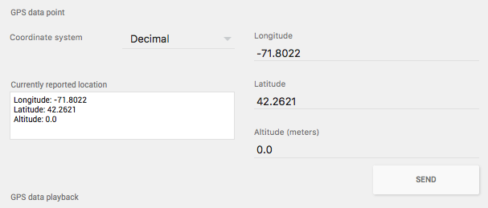
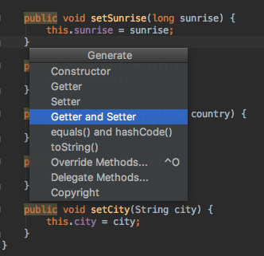
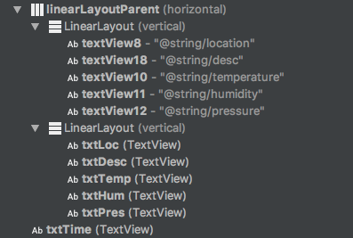
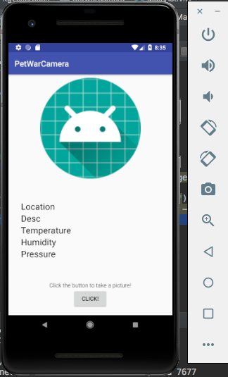
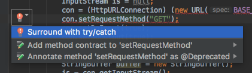

id: Project2Kit

# CS4518 Tutorial: Location and OpenWeatherMap - By Karitta Zellerbach
###### Karitta (Kit) Zellerbach

## Overview of Tutorial
This tutorial will show you how aquire the user's last known location, as well as weather data from the OpenWeatherMap API.

Prerequisites:

* Android Studio 3.2
* Android physical or virtual devices API 27
* Even More Curiosity!
* [Camera Codelab Tutorial](https://wpimobile18b.github.io/tutorials/Camera/#0)

## Getting OpenWeatherMap

1. Go to [OpenWeatherMap](https://openweathermap.org/api) and make an account.
2. Subscribe to the FREE Current weather and forecasts collection
3. Get API Key
4. Wait an hour for the API key, or continue this tutorial.

## Getting the User's Location
Now we're ready to code. To start out, we're not going to jump into using OpenWeatherMap just quite yet. We're going to work on getting the latitude and longitude of the Android device.

First find your `onActivityResult(..)` function. Inside it we're going to add this code.

```javascript
       LocationManager lm = (LocationManager) getSystemService(Context.LOCATION_SERVICE);
        Location location = lm.getLastKnownLocation(LocationManager.GPS_PROVIDER);
        double longitude = -71.8022;
        double latitude = 42.2621;

        if (location != null) {
            longitude = location.getLongitude();
            latitude = location.getLatitude();
        }
```

So the function `lm.getLastKnownLocation(LocationManager.GPS_PROVIDER)` will return null if there is no last location, which is why we need to give it default values. I've set mine to the coordinates of Worcester.

However, before we run the program, we need to add a permission for the location in the AndroidManifest.xml

`<uses-permission android:name="android.permission.ACCESS_FINE_LOCATION" />`

However, if you try to run it, you might notice an error. This is because location needs to be given permission and run time. So in our `onCreate()` method, we're going to add

```javascript
        if (ContextCompat.checkSelfPermission(this,
                Manifest.permission.ACCESS_FINE_LOCATION)
                != PackageManager.PERMISSION_GRANTED) {
            if (ActivityCompat.shouldShowRequestPermissionRationale(this,
                    Manifest.permission.ACCESS_FINE_LOCATION)) {
            } else {
                ActivityCompat.requestPermissions(this,
                        new String[]{Manifest.permission.ACCESS_FINE_LOCATION},
                        REQUEST_LOCATION);
            }
        } else {
            // not granted
        }
```

Now we should have data in our lat and long coordinates. You can check this by calling `System.out.println(latitude + ", " + longitude)` and look at the logs in the Run view in Android Studio. You can double check that these are the right coordinates by looking at the coordinates on the AVD Settings.  



We could just display these coords below our camera image, but let's do something more fun with them...


## OpenWeatherMap
What is OpenWeatherMap? Well it's a simple and fast API that gives you access to current weather, forecasts, maps and historical data in JSON, XML, and HTML formats. A variety of map layers are also available including precipitation, clouds, pressure, temperature, wind, and many more.

We're going to use it to get the current weather. The cool thing about OWM is that you can get weather data for a particular location using the:

1. City Name
2. City ID
3. City Zipcode
4. Geographic Coordinates

You can probably guess which one we're going to use (it's the coordinates).

To do an API call on the coordinates, we will pass the url

`api.openweathermap.org/data/2.5/weather?lat={lat}&lon={lon}`

where lat is the latitude and long is the longituude. We also need to append `&appid={API_KEY}` at the end using your custom API key. 

The response of this GET request will give us a JSON (JavaScript Object Notation) file that looks much like this. As you can see there several different parameters in the API response. You can also test this by putting the url in a browser.

```
{"coord":{"lon":139,"lat":35},
"sys":{"country":"JP","sunrise":1369769524,"sunset":1369821049},
"weather":[{"id":804,"main":"clouds","description":"overcast clouds","icon":"04n"}],
"main":{"temp":289.5,"humidity":89,"pressure":1013,"temp_min":287.04,"temp_max":292.04},
"wind":{"speed":7.31,"deg":187.002},
"rain":{"3h":0},
"clouds":{"all":92},
"dt":1369824698,
"id":1851632,
"name":"Shuzenji",
"cod":200}
```

You can choose which ones you like the most. I'm personally going to choose:

* name - City name
* sys.country - Country
* main.temp - Temperature
* main.humidity - Humidity
* main.pressure - Pressure
* weather[0].description - Description

The full explanation of parameters can be found [here](https://openweathermap.org/current#one).

Now we need a way to extract this data. Let's create a new class and call it WeatherParser.

``` java
import org.json.JSONArray;
import org.json.JSONException;
import org.json.JSONObject;

public class WeatherParser {
		// TODO
		
}
```

While we're at it, let's create a class that can act as a model for our data, called WeatherData.

``` java
public class WeatherData {
		//TODO
		
}
```

So now that we have these two classes, we need to fill them in! So for the WeatherData class, I'm going to create variables for the weather data I care about. Feel free to do the same or use different variables.

``` java
    private float pressure;
    private float humidity;
    private float temp;
 
    private float longitude;
    private float latitude;
    private String country;
    private String city;
    
    private String desc;
```

One of the snazzy things about Android Studio is that you can automatically generate Getters/Setters. You can do this by pressing Cmd + N or going to Code in the toolbar and clicking Generate.



Now that we have our data model we need to work on our Parser. Our WeatherParser should take in a String of data and convert this to a WeatherData object.

``` java
public static WeatherData getWeatherData(String data) throws JSONException {
        WeatherData weather = new WeatherData();
        JSONObject obj = new JSONObject(data);
        
```

Using the JSONObject, we can retrieve the values we care about! Since the JSON file with the weather has a lot of sub-objects and arrays, we need to be careful. It might be useful to create a temporary json file in Android Studio and Auto-Indent it (Cmd + I) so we can visualize the structure.

``` javascript
{
  "coord": {
    "lon": 139,
    "lat": 35
  },
  "sys": {
    "country": "JP",
    "sunrise": 1369769524,
    "sunset": 1369821049
  },
  "weather": [
    {
      "id": 804,
      "main": "clouds",
      "description": "overcast clouds",
      "icon": "04n"
    }
  ],
  "main": {
    "temp": 289.5,
    "humidity": 89,
    "pressure": 1013,
    "temp_min": 287.04,
    "temp_max": 292.04
  },
  "wind": {
    "speed": 7.31,
    "deg": 187.002
  },
  "rain": {
    "3h": 0
  },
  "clouds": {
    "all": 92
  },
  "dt": 1369824698,
  "id": 1851632,
  "name": "Shuzenji",
  "cod": 200
}
```

So firstly, I want to access the name of the city. This is an easy one since it's not embedded in another object.
I can simply call
`obj.getString("name");`. Also, remember that we made those getters and setters for our weather data, which means we can call `weather.setCity(obj.getString("name"));`

Not too bad, right?

Well now it gets a little more intense. You might notice that the lat and lon parameters are within the "coord". This means we need to get the coord object first, then get each value:

```
weather.setLatitude((float)(obj.getJSONObject("coord")).getDouble("lat"));
weather.setLongitude((float)(obj.getJSONObject("coord")).getDouble("lon"));
```

Just takes a little bit of chaining!

```
weather.setHumidity((float) obj.getJSONObject("main").getDouble("humidity"));
weather.setPressure((float) obj.getJSONObject("main").getDouble("pressure"));
weather.setTemp((float) obj.getJSONObject("main").getDouble("temp"));
```

Be careful if you choose to use the "weather" data, as that is nested in an array.

You can use `JSONArray array = obj.getJSONArray("weather");` to get the array. Then call:

```
weather.setWeatherId(array.getJSONObject(0).getInt("id"));
weather.setDescr(array.getJSONObject(0).getString("description"));
weather.setCondition(array.getJSONObject(0).getString("main"));
weather.setIcon(array.getJSONObject(0).getString("icon"));
```

Now it's finally time to display this data! Feel free to use whatever layout you prefer, but for the sake of this tutorial I'm going to use some LinearLayouts. Specifically nesting two vertical LinearLayouts within a horizontal LinearLayout.



This way we can achieve something that looks like this:



## Displaying the Data
Now we need to display our data. Similar to the UI tutorial, create variables to reference your TextViews where you want to show the data.

```
mPhotoView = (ImageView) findViewById(R.id.mImageView);
mTime = (TextView) findViewById(R.id.txtTime);
mLoc = (TextView) findViewById(R.id.txtLoc);
mPres = (TextView) findViewById(R.id.txtPres);
mHum = (TextView) findViewById(R.id.txtHum);
mTemp = (TextView) findViewById(R.id.txtTemp);
mPath = (TextView) findViewById(R.id.mTextView);
```

Now remember AsyncTasks? Well we're going to make one of those.

Let's make a private subclass called WeatherTask which will extend AsyncTask.

```
private class WeatherTask extends AsyncTask<String, Void, WeatherData> {
	private String BASE_URL = "http://api.openweathermap.org/data/2.5/weather?lat=";
	private String API_KEY = "{INSERT YOUR API}";
        
        @Override
        protected WeatherData doInBackground(String... params) {
        	// TODO
        }


        @Override
        protected void onPostExecute(WeatherData weather) {
            super.onPostExecute(weather);
            // TODO

        }
    }
```

We're going to use doInBackground to call a HTTP GET. There's a lot going on so I'll break it down.

```
		@Override
        protected WeatherData doInBackground(String... params) {
            HttpURLConnection con = null;
            InputStream is = null;
            con = (HttpURLConnection) (new URL(BASE_URL + params[0] +  "&lon=" + params[1] + API_KEY)).openConnection();
            con.setRequestMethod("GET");
            con.setDoInput(true);
            con.setDoOutput(true);
            con.connect();

            StringBuffer buffer = new StringBuffer();
            is = con.getInputStream();

            BufferedReader br = new BufferedReader(new InputStreamReader(is));
            String line = null;
            while ((line = br.readLine()) != null)
                buffer.append(line + "\r\n");

            is.close();
            con.disconnect();
            String data = buffer.toString();
            JSONObject object = new JSONObject(data);
            WeatherData weather = WeatherParser.getWeatherData(data);
            return weather;

        }
```
Essentially we're opening a http connection to our API URL, calling a GET request, then using a string buffer to load the JSON reponse as a string. Finally we use our WeatherParser to create our WeatherData object.

You'll notice a lot of red squiggly lines... that's because of all the exceptions that are possible. Feel free to automatically create the try/catch statements by hovering over the red lightbulbs.



Now in the onPostExecute method we can set all the text views!

```
		@Override
        protected void onPostExecute(WeatherData weather) {
            super.onPostExecute(weather);
            mTemp.setText("" + Math.round((weather.getTemp() - 273.15)) + " degrees (C)");
            mLoc.setText(weather.getCity() + ", " + weather.getCountry());
            mHum.setText("" + weather.getHumidity() + "%");
            mPres.setText("" + weather.getPressure() + " hPa");
            mDesc.setText("" + weather.getDesc());
        }
```

So finally we can go back to the lines of code that we used to get the longitude and latitude and call our custom WeatherTask.

```
       LocationManager lm = (LocationManager) getSystemService(Context.LOCATION_SERVICE);
        Location location = lm.getLastKnownLocation(LocationManager.GPS_PROVIDER);
        double longitude = -71.8022;
        double latitude = 42.2621;

        if (location != null) {
            longitude = location.getLongitude();
            latitude = location.getLatitude();
        }

        WeatherTask task = new WeatherTask();
        task.execute(new String[]{String.valueOf(latitude),String.valueOf(longitude)});
```

If you run the program you should see something lke this!


Wait, you mean you don't see the timestamp? Well that's a quick fix.

You should have stored the path to your image somewhere from the Camera tutorial. You can simply create a reference to this file, and check the last modified date to get the time that the photo was taken!

```
        File file = new File(pathToFile);
        if (file.exists()) {
            long date = file.lastModified();
            Date fileData = new Date(date);
            mTime.setText(fileData.toString());
        }
```

Now you should have a pretty good display of weather data to show your insane data aquisition skills!

## Summary and Resources
In this tutorial we built on the Camera codelab tutorial to use data aquisiton from the OpenWeatherMap API by first aquiring the geographic location of our android device.

If you want to learn more about OpenWeatherMap, there are tons of resources online, especially on the [OpenWeatherMap Website](https://openweathermap.org/api).
