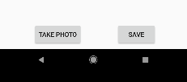
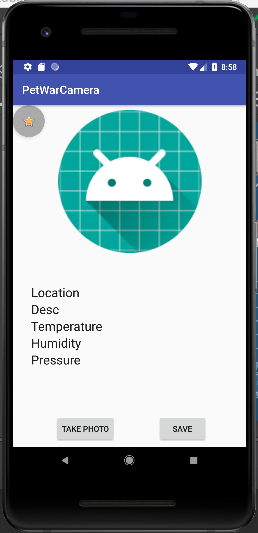
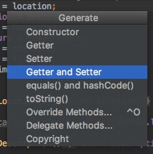
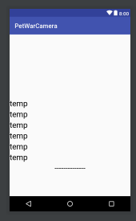
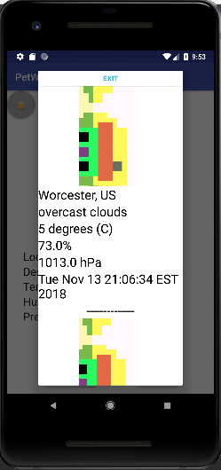

id: Project3Kit


# CS4518 Tutorial: Redesigning SQLite 3 for Custom Storage and List View Display --  By Karitta Zellerbach
###### Karitta (Kit) Zellerbach

## Overview of Tutorial
This tutorial will show you how to redesign SQLite3 to store your images, timestamps, locations acquired in Project 2. You will also learn how to display this data in a custom List View.

Prerequisites:

* Android Studio 3.2
* Android physical or virtual devices API 27
* Even More Curiosity!
* My Project 2 OpenWeatherMap Tutorial (or any data you want to store)
* [Database Codelab Tutorial](https://wpimobile18b.github.io/tutorials/Database/#0)

## Merge Files

With your Project 2 open in Android Studio, make sure you add the LogEntryDbHelper and LogContract class from the database codelab into your project.

All you should need to do to finish merging the two projects is add a global variable `LogEntryDbHelper mDbHelper;` to your MainActivity class and then add `mDbHelper = new LogEntryDbHelper(this);` to your onCreate() call.


## Update the LogContract
Now we're going to need to update your LogContract class to store the data you want to store. Since I'm storing weather data, my class looks like this:

```
public class LogContract {

    private LogContract() {
    }

    public static class LogEntry implements BaseColumns {
        public static final String TABLE_NAME = "logEntries";
        public static final String COLUMN_NAME_LOCATION = "location";
        public static final String COLUMN_NAME_DESC = "description";
        public static final String COLUMN_NAME_TEMP = "temperature";
        public static final String COLUMN_NAME_HUMIDITY = "humidity";
        public static final String COLUMN_NAME_PRESSURE = "pressure";
        public static final String COLUMN_NAME_TIME = "time";
        public static final String COLUMN_NAME_FILEPATH = "filepath";


        public static final String SQL_CREATE_ENTRIES =
                "CREATE TABLE " + LogEntry.TABLE_NAME + " (" +
                        LogEntry._ID + " INTEGER PRIMARY KEY," +
                        LogEntry.COLUMN_NAME_LOCATION + " TEXT," +
                        LogEntry.COLUMN_NAME_DESC + " TEXT," +
                        LogEntry.COLUMN_NAME_TEMP + " TEXT," +
                        LogEntry.COLUMN_NAME_HUMIDITY + " TEXT," +
                        LogEntry.COLUMN_NAME_PRESSURE + " TEXT," +
                        LogEntry.COLUMN_NAME_TIME + " TEXT," +
                        LogEntry.COLUMN_NAME_FILEPATH + " TEXT)";

        public static final String SQL_DELETE_ENTRIES =
                "DROP TABLE IF EXISTS " + LogEntry.TABLE_NAME;
    }
}
```


Now lets add another button to the layout to save the photo and it's data into the database.



I've attached this button to the onSubmit() function below:


```
    public void onSubmit(View v) {
        SQLiteDatabase db = mDbHelper.getWritableDatabase();
        ContentValues values = new ContentValues();

        values.put(LogContract.LogEntry.COLUMN_NAME_DESC, String.valueOf(mDesc.getText()));
        values.put(LogContract.LogEntry.COLUMN_NAME_HUMIDITY, String.valueOf(mHum.getText()));
        values.put(LogContract.LogEntry.COLUMN_NAME_LOCATION, String.valueOf(mLoc.getText()));
        values.put(LogContract.LogEntry.COLUMN_NAME_PRESSURE, String.valueOf(mPres.getText()));
        values.put(LogContract.LogEntry.COLUMN_NAME_TEMP, String.valueOf(mTemp.getText()));
        values.put(LogContract.LogEntry.COLUMN_NAME_TIME, String.valueOf(mTime.getText()));
        values.put(LogContract.LogEntry.COLUMN_NAME_FILEPATH, mCurrentPhotoPath);

        long newRowId = db.insert(LogContract.LogEntry.TABLE_NAME, null, values);

        Snackbar.make(v, "Pet Submitted!", Snackbar.LENGTH_LONG)
                .setAction("Action", null).show();
    }
```

Because I store the my data in various text fields, I use `String.valueOf(mDesc.getText())`. However, if you only use internal variables you can just refer to them instead.

I also decided to add a Snackbar so the user know's when the image has been saved. You can choose to do this, or perhaps clear the textfields instead.

Now when you open your app, take a photo, then press the save button, the data should be saved in your database. While this is good, it's pretty limited. Let's do something with our data.

## Displaying Database Data

Now we need a way to display our data. I decided to create a Custom ListView that is displayed in a Dialog Window which is called by pressing a Floating Action Button.

To start, let's add a Floating Action Button to the top layer of our layout. You can add it wherever you like! I put mine on the top left with a star icon.




After you give it an id and assign it to a variable in your code using `findViewById()`, we want to assign it a `onClickListener()` in the `onCreate()` call in our MainActivity class. We'll leave this empty for now.

```
fab.setOnClickListener(new View.OnClickListener() {
            @Override
            public void onClick(View view) {
				...
            }
        });
```
 
Now it's time to create the layout for our dialog window.

I create a dialog xml layout file called `custom_dialog.xml`. In this layout, I have declared a ListView and a Button to close the dialog, as can be seen below:

```
<LinearLayout xmlns:android="http://schemas.android.com/apk/res/android"
    xmlns:tools="http://schemas.android.com/tools"
    android:layout_width="match_parent"
    android:layout_height="match_parent"
    android:orientation="vertical">
    <Button
        android:id="@+id/btn_exit"
        android:layout_width="match_parent"
        android:layout_height="30dp"
        android:background="@android:color/white"
        android:clickable="true"
        android:text="Exit"
        android:textColor="#5DBCD2"
        android:textStyle="bold" />    
    <ListView
        android:id="@+id/List"
        android:layout_width="match_parent"
        android:layout_height="wrap_content" >
    </ListView>
</LinearLayout>
```

In order to display the data from our database into a ListView, it would great if we had a model to represent out data.

Let's create a custom Log class to act as the model for each row of our database. The variables in your class should match the columns in your table.

```
public class Log {
    private String location;
    private String description;
    private String humidity;
    private String temperature;
    private String pressure;
    private String filepath;
    private String time;
}    
```

Using Command + N, you can select to generate the Constructor and all the Getters and Setters.



Now we need to create a custom layout XML file that defines the structure for each individual item (or group of weather data) in our ListView. If you didn't know, a ListView is a ViewGroup that displays a list of vertically scrollable items.

For each item/row in the database, I display an ImageView and a series of TextViews for the weather data. Make sure you the id names are representative of the data you will put in them, as we will need to reference them soon.

Here's what mine looks like - it's called `row_layout.xml`

```
<?xml version="1.0" encoding="utf-8"?>
<android.support.constraint.ConstraintLayout xmlns:android="http://schemas.android.com/apk/res/android"
    android:layout_width="match_parent"
    android:layout_height="match_parent"
    xmlns:app="http://schemas.android.com/apk/res-auto">

    <ImageView
        android:id="@+id/text_path"
        android:layout_width="wrap_content"
        android:layout_height="200dp"
        android:textColor="#000"
        android:textSize="25sp"/>

    <TextView
        android:id="@+id/text_loc"
        android:layout_width="wrap_content"
        android:layout_height="wrap_content"
        android:text="temp"
        android:textColor="#000"
        android:textSize="25sp"
        app:layout_constraintTop_toBottomOf="@id/text_path"/>

    <TextView
        android:id="@+id/text_desc"
        android:layout_width="wrap_content"
        android:layout_height="wrap_content"
        android:text="temp"
        android:textColor="#000"
        android:textSize="25sp"
        app:layout_constraintTop_toBottomOf="@id/text_loc"/>

    <TextView
        android:id="@+id/text_temp"
        android:layout_width="wrap_content"
        android:layout_height="wrap_content"
        android:text="temp"
        android:textColor="#000"
        android:textSize="25sp"
        app:layout_constraintTop_toBottomOf="@id/text_desc"/>

    <TextView
        android:id="@+id/text_hum"
        android:layout_width="wrap_content"
        android:layout_height="wrap_content"
        android:text="temp"
        android:textColor="#000"
        android:textSize="25sp"
        app:layout_constraintTop_toBottomOf="@id/text_temp"/>

    <TextView
        android:id="@+id/text_pres"
        android:layout_width="wrap_content"
        android:layout_height="wrap_content"
        android:text="temp"
        android:textColor="#000"
        android:textSize="25sp"
        app:layout_constraintTop_toBottomOf="@id/text_hum"/>

    <TextView
        android:id="@+id/text_time"
        android:layout_width="wrap_content"
        android:layout_height="wrap_content"
        android:text="temp"
        android:textColor="#000"
        android:textSize="25sp"
        app:layout_constraintTop_toBottomOf="@id/text_pres"/>
        
    <TextView
        android:id="@+id/text_fill"
        android:layout_width="match_parent"
        android:layout_height="wrap_content"
        android:text="--------------"
        android:textColor="#000"
        android:textSize="25sp"
        android:gravity="center"
        app:layout_constraintTop_toBottomOf="@id/text_time"/>
</android.support.constraint.ConstraintLayout>
```
It should look something like this in the Design window. But remember, it won't look exactly like this in the app, as we will be displaying it in a dialog window.




Now we need to make a custom Adapter class that extends the BaseAdapter class. This will allow us to populate the ListView with our custom data! 

In the ListView, the list items are automatically inserted into the list using an adapter that is connected to a source, such as an array or a database query.

To implement BaseAdapter, we must override following methods:

* int getCount()
* Object getItem(int position)
* long getItemId(int position)
* View getView(int position, View convertView, ViewGroup parent)


```
public class CustomAdapter extends BaseAdapter {

    private ArrayList<Log> petList;
    private Context context;

    public CustomAdapter(ArrayList<Log> list, Context cont) {
        this.petList = list;
        this.context = cont;
    }

    @Override
    public int getCount() {
        return this.petList.size();
    }

    @Override
    public Object getItem(int position) {
        return this.petList.get(position);
    }

    @Override
    public long getItemId(int i) {
        return i;
    }

    private static class ViewHolder {
        private TextView location;
        private TextView description;
        private TextView humidity;
        private TextView temperature;
        private TextView pressure;
        private ImageView filepath;
        private TextView time;
    }

    @Override
    public View getView(int position, View convertView, ViewGroup parent) {
        ViewHolder holder = null;

        if (convertView == null) {
            LayoutInflater inf = (LayoutInflater) context.getSystemService(Context.LAYOUT_INFLATER_SERVICE);
            convertView = inf.inflate(R.layout.row_layout, null);

            holder = new ViewHolder();
            holder.location = (TextView) convertView.findViewById(R.id.text_loc);
            holder.description = (TextView) convertView.findViewById(R.id.text_desc);
            holder.humidity = (TextView) convertView.findViewById(R.id.text_hum);
            holder.temperature = (TextView) convertView.findViewById(R.id.text_temp);
            holder.pressure = (TextView) convertView.findViewById(R.id.text_pres);
            holder.filepath = (ImageView) convertView.findViewById(R.id.text_path);
            holder.time = (TextView) convertView.findViewById(R.id.text_time);

            convertView.setTag(holder);
        } else {
            holder = (ViewHolder) convertView.getTag();
        }

        holder.location = (TextView) convertView.findViewById(R.id.text_loc);
        holder.description = (TextView) convertView.findViewById(R.id.text_desc);
        holder.humidity = (TextView) convertView.findViewById(R.id.text_hum);
        holder.temperature = (TextView) convertView.findViewById(R.id.text_temp);
        holder.pressure = (TextView) convertView.findViewById(R.id.text_pres);
        holder.filepath = (ImageView) convertView.findViewById(R.id.text_path);
        holder.time = (TextView) convertView.findViewById(R.id.text_time);

        Log pet = petList.get(position);
        holder.location.setText(pet.getLocation());
        holder.description.setText(pet.getDescription());
        holder.humidity.setText(pet.getHumidity());
        holder.temperature.setText(pet.getTemperature());
        holder.pressure.setText(pet.getPressure());
        Bitmap bitmap = BitmapFactory.decodeFile(pet.getFilepath());
        holder.filepath.setImageBitmap(bitmap);
        holder.time.setText(pet.getTime());

        return convertView;
    }
}
```
As you can see, this class makes use of our Log class, as well as our `row_layout.xml` file. This happens specifically in the line `convertView = inf.inflate(R.layout.row_layout, null);`. If your layout isn't called `row_layout`, make sure you update it to `R.layout.[your_layout_name]`.

The `getView()` method is the most important, as it sets the indivudal text views and image view that we declared in our `row_layout.xml` file. We have to inflate our `row_layout.xml` file then match the view's in the holder object to the view id's we declared in the xml file. After that we can set the text the the values in the Log object from the specified position integer. We will never call `getView()`, this will all happen automatically, which is why it is important that we implement the overridden BaseAdapter methods correctly.

Back in the LogEntryDbHelper class we need to add a function to return a list of all our entries. Since we want all entries, our query will be `"select * from " + LogContract.LogEntry.TABLE_NAME`.


```
public ArrayList<Log> getAllData() {
        ArrayList<Log> petList = new ArrayList<>();
        SQLiteDatabase db = this.getWritableDatabase();
        Cursor res = db.rawQuery("select * from " + LogContract.LogEntry.TABLE_NAME, null);

        while (res.moveToNext()) {
            String a = res.getString(1);
            String b = res.getString(2);
            String c = res.getString(3);
            String d = res.getString(4);
            String e = res.getString(5);
            String g = res.getString(6);
            String f = res.getString(7);
            Log newPet = new Log(a, b, d, c, e, f, g);
            petList.add(newPet);
        }
        return petList;
    }
```
Make sure you know which column is what, as the `res.getString(index)` returns the data in the column specified by the index value. Index 0 is most likely your primary id value, so we can skip that unless you want to display the entry number!

Now we can finally populate our `onClick()` listener for our Floating Action Button. Pay attention to the line `ListView lv = (ListView) dialog.findViewById(R.id.List);`. In my `custom_dialog.xml` file I gave my ListView the id of List, so make sure you update this line to match the name of your ListView.

```
    @Override
    public void onClick(View view) {
        final Dialog dialog = new Dialog(MainActivity.this);
        dialog.setContentView(R.layout.custom_dialog);
        ListView lv = (ListView) dialog.findViewById(R.id.List);

        ArrayList<Log> petList = mDbHelper.getAllData();

        CustomAdapter petAdapter = new CustomAdapter(petList, MainActivity.this);
        lv.setAdapter(petAdapter);

        dialog.setCancelable(true);
        dialog.setTitle("ListView");
        
        Button dialogButton = (Button) dialog.findViewById(R.id.btn_exit);
        dialogButton.setOnClickListener(new View.OnClickListener() {
              @Override
              public void onClick(View v) {
                   dialog.dismiss();
              }
          });
        
        dialog.show();

    }
```

Now when we take picture, add it to the database using our submit button, then click on the Floating Action Button, we should see a list of all our data entries!



Looks pretty solid to me. Feel free to improve this by adding a search bar for custom queries, rather than displaying all the rows. Also the ListView is pretty boring. It might be worth improving the UI or experimenting with fragments!


## Summary and Resources
In this tutorial we built on the Database codelab tutorial as well as our data aqusition from Project 2 to save images and data to a SQLite database and display all the results in a List View that appears in a custom dialog window.

To learn more about List Views, please visit this [page](https://guides.codepath.com/android/Using-a-BaseAdapter-with-ListView).

